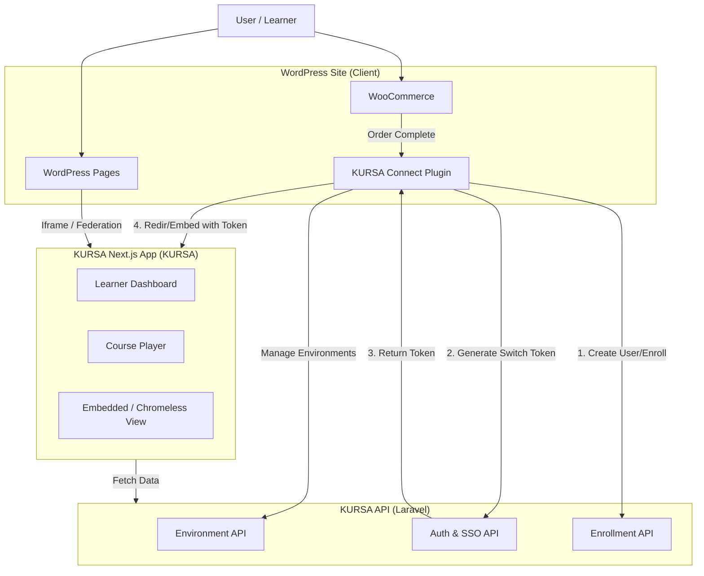

# KURSA WordPress Integration Implementation Plan

This document outlines the technical strategy to integrate **KURSA** functionalities directly into a **WordPress** website. The goal is to allow site owners to manage campuses, sell courses via WooCommerce, and provide a seamless learning experience without users feeling like they have left the WordPress site.

## 1. Executive Summary

The solution involves building a custom **WordPress Plugin ("KURSA Connect")** that acts as a bridge between the WordPress installation and the KURSA Ecosystem. 

**Key Features:**
*   **Programmatic Campus (Environment) Creation:** Manage KURSA environments directly from the WP Admin Dashboard.
*   **Seamless "Pay & Learn":** Users purchase on WooCommerce and are instantly enrolled and logged into the learning environment via a secure hand-off (SSO).
*   **Embedded Experience:** Display course catalogues and player interfaces within WordPress pages using specialized "federated" or "embedded" views.
*   **Product Sync:** Map WooCommerce products to KURSA Courses/Digital Products.

## 2. System Architecture

## 3. Implementation Phases

### Phase 1: The "KURSA Connect" WordPress Plugin

A custom WordPress plugin is required to handle API communication and eCommerce logic.

#### 3.1 Plugin Configuration
*   **Settings Page:**
    *   `API URL` (e.g., `https://certification.csl-brands.com`)
    *   `App Key / Secret` (for secure server-to-server communication).
    *   `Default Tenant/Environment ID` (optional, if one site maps to one campus).

#### 3.2 Campus Management (Admin Dashboard)
Create a WP Admin page that interacts with `KURSA-Certification-Rest-API`:
*   **List Environments:** `GET /api/environments` (filtered by the authenticated API Key owner).
*   **Create Campus:** Form submitting to `POST /api/environments`.
    *   Example Fields: Name, Subdomain (e.g., `wp-client.csl-brands.com`), Brand Colors (synced from WP theme?).
*   **Edit Campus:** `PUT /api/environments/{id}`.

#### 3.3 Product Synchronization & WooCommerce Integration
*   The plugin will add a "Linked KURSA Product" field to WooCommerce Product settings (Simple Product).
*   **API Hook:** `woocommerce_payment_complete` or `woocommerce_order_status_completed`.
    1.  **Check User:** Does the WP user email exist in KURSA?
        *   *No:* Call `POST /api/users` (create user).
        *   *Yes:* Get User ID.
    2.  **Enroll:** Call `POST /api/environments/{env_id}/users` to add user to the campus (if not already).
    3.  **Grant Access:** Call Enrollment API to unlock the specific course/product.

#### 3.4 Single Sign-On (SSO) & Seamless Access
To satisfy "start learning... without leaving", we utilize the **Switch Token** mechanism found in `environments-api.ts`.

*   **Logic:**
    1.  WP generates a "Login Link" or "Start Learning" button.
    2.  Server-side, WP calls `POST /auth/academy-switch-token` (or a dedicated SSO endpoint) with the User ID and Target Environment.
    3.  API returns a single-use `token`.
    4.  WP redirects user to `https://campus.csl-brands.com/auth/validate-switch-token?token={token}&redirect=/dashboard`.
    5.  Result: User is logged in automatically.

#### 3.5 Financial Reconciliation & Commissions
The user specifically requested management of **commissions and taxes**. The CSL Backend (`PaymentService` and `InstructorCommissionService`) handles this logic automatically when a Transaction is created.

*   **Logic:**
    1.  **Transaction Trigger:** When WP collects payment (e.g., $100), the Plugin calls a new CSL endpoint `POST /api/payments/external` (or triggers `PaymentService::processManualPayment`).
    2.  **Auto-Calculation:** CSL's `PaymentService` runs `calculateTransactionAmountsWithCommissionIncluded()`.
        *   **Tax:** `TaxZoneService` calculates tax based on the student's location (passed from WP).
        *   **Commission:** `InstructorCommissionService` splits the remaining amount into `Platform Fee` (Site Owner) and `Instructor Share`.
    3.  **Debt Recording:** Since the money is in the WP Owner's WooCommerce account, CSL records this transaction as "Paid External".
        *   Ideally, a **"Platform Debt"** ledger ensures the Site Owner knows they owe the Instructor their share (if the course was taught by a third party).
        *   If the Site Owner *is* the Instructor, the split is internal but accurate for tax reporting.

---

### Phase 2: Frontend Federation & Embedding

The user wants to "federate components... into wordpress". There are two valid approaches:

#### Strategy A: "Chromeless" Embedding (Recommended for Stability)
Since the main KURSA App is Next.js, we create specific "Embedded Layouts" that hide the sidebar, header, and footer.

1.  **Next.js Implementation:**
    *   Create routes: `/embed/dashboard`, `/embed/course/[id]`.
    *   These routes check for a `?token=...` query param to auth the user session via cookie/local storage.
    *   They render *only* the content area.
2.  **WordPress Implementation:**
    *   **Shortcode:** `[kursa_embed type="course" id="123"]`.
    *   **Output:** Renders a responsive `<iframe>` pointing to the "Chromeless" Next.js route.
    *   **Auto-Auth:** The iframe `src` includes the SSO token generated on the fly by the WP Plugin.
    *   **Resizing:** Use `POSTMessage` between Next.js and WP to auto-resize the iframe height (prevent double scrollbars).

#### Strategy B: Module Federation (Advanced)
If true "Module Federation" is required (sharing pure JS components):
1.  **Next.js:** Configure `@module-federation/nextjs-mf` to expose `CourseCard`, `catalogue`, `Player` as remotes.
2.  **WordPress:**
    *   This is complex because WP is PHP. You would need a "Container" React app running inside WP (using `ReactDOM.render` on a `div`).
    *   This container would configured to consume the Next.js remotes.
    *   **Pros:** Native DOM integration (no iframe).
    *   **Cons:** High complexity. Styling conflicts (Tailwind classes from Next.js might clash with WP theme).

**Verdict:** Strategy A (Embed/Iframe with Token) is 10x faster to implement, more robust against WP theme conflicts, and fulfills the "seamless" requirement if styled correctly.

---

## 4. Required Code Changes

### Backend (`KURSA-Certification-Rest-API`)
- [ ] **API Keys:** Ensure `sanctum` or a new "Service-to-Service" auth middleware allows a WP Plugin to act on behalf of an owner without a user session.
- [ ] **SSO Endpoint:** Verify `generateAcademySwitchToken` can be called server-to-server.
- [ ] **External Payment Endpoint:** Expose a secure endpoint for WP to record transactions that triggers `PaymentService` (ensuring `TaxZoneService` and `InstructorCommissionService` run).
- [ ] **CORS:** Whitelist the client's WordPress domain.

### Frontend (`KURSA-Certification`)
- [ ] **Embed Layout:** Create a `app/embed/layout.tsx` that strips navigation.
- [ ] **Auth Handler:** Ensure `/embed` routes handle the `token` param to initialize the session immediately before rendering.
- [ ] **Resize Observer:** Add code to send height updates to parent window (for Iframe resizing).

### WordPress Plugin (New Project)
- [ ] Scaffold `KURSA-connect` plugin.
- [ ] Admin pages for API Config & Campus Management.
- [ ] WooCommerce Hooks.
- [ ] Shortcode Logic (`[kursa_dashboard]`).

## 5. Development Roadmap

1.  **Week 1: Plugin Core & Auth**
    *   Setup WP Plugin structure.
    *   Implement API Client in PHP (Guzzle).
    *   Test "Create Environment" from WP Admin.
2.  **Week 2: eCommerce & Finance**
    *   Add "Product ID" field to WooCommerce.
    *   Implement `payment_complete` hook to create Order + Transaction in CSL.
    *   Verify `InstructorCommission` and `Tax` records are created correctly in CSL DB.
3.  **Week 3: Frontend Embedding**
    *   Create `/embed` routes in Next.js.
    *   Implement SSO Token generation in WP.
    *   Create Shortcodes for embedding.
4.  **Week 4: Final Polish**
    *   Style matching (pass WP theme colors to KURSA via query params?).
    *   Security Audit (ensure tokens are short-lived and secure).
