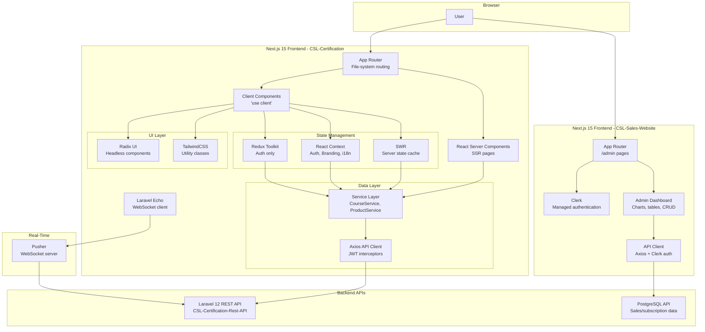

# 10. Frontend Architecture

## 10.1 Frontend Overview

The CSL platform employs **two separate Next.js 15 applications** built with React 19, each serving distinct user groups and use cases:

1. **CSL-Certification Frontend** - Instructor and learner interface (certification, courses, earnings, certificates)
2. **CSL-Sales-Website Frontend** - Super admin interface (sales management, subscriptions, referrals, environment configuration)

Both frontends follow **modern React best practices** with:
- **Next.js 15 App Router** (file-system based routing)
- **React Server Components** (RSC) for improved performance
- **TypeScript** for type safety
- **TailwindCSS + Radix UI** for accessible, consistent UI
- **SWR / React Query** for client-side data fetching
- **Axios** for HTTP client with interceptors
- **Redux Toolkit** (limited use) for complex global state
- **React Context API** for feature-specific state (auth, branding, subscriptions)

**Key Differentiators:**
- **CSL-Certification:** Complex multi-tenant UI with dynamic branding, course player, assessment engine
- **CSL-Sales-Website:** Admin dashboard with charts, data tables, CRUD operations, Clerk authentication

---

## 10.2 CSL-Certification Frontend Architecture

### 10.2.1 Application Structure

```
CSL-Certification/
├── app/                        # Next.js 15 App Router pages
│   ├── layout.tsx             # Root layout with 10+ providers
│   ├── page.tsx               # Landing/redirect page
│   ├── auth/                  # Authentication pages (login, register)
│   ├── dashboard/             # Main instructor/admin dashboard
│   ├── courses/               # Course management pages
│   ├── templates/             # Template builder (Course Editor)
│   │   └── [id]/
│   │       └── preview-room/  # Course player/learner view
│   ├── products/              # Product catalog management
│   ├── orders/                # Order history
│   ├── finances/              # Revenue analytics
│   ├── analytics/             # Course analytics, certificates
│   ├── learners/              # Learner management (teams, enrollments)
│   ├── settings/              # Environment settings, branding
│   ├── storefront/            # Public-facing storefront (SSR)
│   │   └── [domain]/          # Multi-tenant storefront
│   ├── checkout/              # Checkout flow (cart, payment)
│   │   └── [domain]/
│   └── certificate-verifier/  # Public certificate verification
│
├── components/                # Reusable React components
│   ├── ui/                    # Radix UI + shadcn/ui components
│   │   ├── button.tsx
│   │   ├── card.tsx
│   │   ├── dialog.tsx
│   │   ├── data-table/        # Sortable, filterable tables
│   │   └── ...                # 50+ UI primitives
│   ├── auth/                  # Auth components (AuthProvider, logout)
│   ├── providers/             # Context providers (theme, branding, i18n)
│   ├── courses/               # Course-specific components
│   ├── activities/            # Activity editors (video, quiz, assignment)
│   ├── blocks/                # Block management (lessons, modules)
│   ├── learners/              # Learner management components
│   ├── orders/                # Order components
│   ├── products/              # Product components
│   ├── settings/              # Settings panels
│   ├── storefront/            # Storefront components (product cards, cart)
│   └── templates/             # Template builder components
│
├── lib/                       # Business logic and utilities
│   ├── api.ts                 # Axios API client (interceptors, auth)
│   ├── services/              # Service layer (auth, course, product, payment)
│   │   ├── auth-service.ts
│   │   ├── course-service.ts
│   │   ├── product-service.ts
│   │   ├── payment-gateway-service.ts
│   │   └── ...                # 20+ service files
│   ├── redux/                 # Redux Toolkit store (minimal use)
│   │   ├── store.ts
│   │   └── slices/authSlice.ts
│   ├── types.ts               # TypeScript types
│   └── utils.ts               # Helper functions (cn, date formatting)
│
├── contexts/                  # React Context providers
│   └── SubscriptionContext.tsx # Subscription state management
│
├── hooks/                     # Custom React hooks
│   ├── use-toast.ts
│   ├── use-mobile.tsx
│   ├── useBlocks.ts
│   ├── useTemplate.ts
│   ├── useSubscription.ts
│   ├── useLanguage.ts
│   └── useEcho.ts             # Laravel Echo (WebSockets)
│
├── public/                    # Static assets
│   ├── icons/                 # PWA icons
│   ├── images/
│   └── manifest.json          # PWA manifest
│
├── styles/
│   └── globals.css            # TailwindCSS base styles
│
└── next.config.mjs            # Next.js configuration
```

### 10.2.2 Provider Hierarchy

**Root Layout Provider Nesting:**
```tsx
<ErrorBoundary>
  <HelmetProvider>                         // react-helmet-async for SEO
    <I18nProvider>                          // Internationalization (i18next)
      <ThemeProvider>                       // Dark/light mode (next-themes)
        <AuthProvider>                      // JWT authentication context
          <RouteProvider>                   // Route change handling
            <NavigationProvider>            // Navigation state
              <BrandingProvider>            // Multi-tenant branding (colors, logos)
                <BrandingLoadingWrapper>    // Branding fetch loading state
                  <SubscriptionContextProvider> // Subscription state
                    <SubscriptionProvider>  // Subscription validation
                      {children}            // Page content
                      <Toaster />           // Toast notifications
                      <SupportCenter />     // Live chat widget
                      <AiBuilder />         // AI-powered template builder
                      <GlobalLanguageSwitcher /> // Language selector
                      <EnvironmentNotificationsListener /> // Real-time notifications
```

**Key Providers:**
- **AuthProvider** (`components/auth/auth-provider.tsx`) - Manages JWT tokens, user state, login/logout
- **BrandingProvider** (`components/providers/branding-provider.tsx`) - Fetches environment-specific branding (colors, logos, fonts), applies CSS variables dynamically
- **I18nProvider** (`components/providers/I18nProvider.tsx`) - Multi-language support (English, French, Spanish)
- **ThemeProvider** (`components/providers/theme-provider.tsx`) - Dark/light mode toggle with system preference detection
- **SubscriptionProvider** - Validates environment subscription status, restricts features

---

### 10.2.3 Routing Architecture

**Next.js 15 App Router Features:**
- **File-system based routing:** `app/courses/page.tsx` → `/courses`
- **Dynamic routes:** `app/templates/[id]/page.tsx` → `/templates/123`
- **Nested layouts:** Each folder can have `layout.tsx` for persistent UI
- **Multi-tenant routing:** `app/storefront/[domain]/page.tsx` → `/storefront/example.com`
- **Loading states:** `loading.tsx` for automatic loading UI
- **Error boundaries:** `error.tsx` for route-level error handling

**Protected Routes:**
- Middleware-free approach (AuthProvider checks authentication in layout)
- Redirects to `/auth/login` if not authenticated
- Role-based access control (instructor, admin, learner) via `user-role` localStorage

**Public Routes:**
- `/storefront/[domain]` - Public course catalog (SSR)
- `/checkout/[domain]` - Checkout flow (guest checkout supported)
- `/certificate-verifier` - Certificate verification (no auth required)

---

### 10.2.4 State Management Strategy

**Multi-Layer State Management:**

**1. Server State (SWR):**
```typescript
// Example: Fetching courses with SWR
import useSWR from 'swr'

const { data, error, isLoading } = useSWR('/courses', fetcher, {
  revalidateOnFocus: true,
  dedupingInterval: 60000, // 1 minute
})
```
- **Used for:** API data (courses, products, orders, analytics)
- **Benefits:** Automatic caching, revalidation, deduplication
- **Libraries:** SWR (primary), React Query (alternative for complex queries)

**2. Client State (React Context):**
```typescript
// BrandingProvider example
const BrandingContext = createContext<BrandingContextType | undefined>(undefined)

export function BrandingProvider({ children }) {
  const [branding, setBranding] = useState<Branding | null>(null)
  const [loading, setLoading] = useState(true)

  // Fetch branding on mount
  useEffect(() => {
    fetchBranding().then(setBranding)
  }, [])

  return (
    <BrandingContext.Provider value={{ branding, loading }}>
      {children}
    </BrandingContext.Provider>
  )
}
```
- **Used for:** Feature-specific state (auth, branding, subscriptions, navigation)
- **Benefits:** Scoped state, no prop drilling, React-native

**3. Global State (Redux Toolkit - Limited Use):**
```typescript
// Redux store (minimal use)
export const store = configureStore({
  reducer: {
    auth: authReducer, // Only for complex auth flows
  },
})
```
- **Used for:** Complex authentication state (token refresh, multi-tab sync)
- **Rationale:** Most state handled by Context/SWR to avoid Redux boilerplate

**4. URL State:**
- Query params for filters, pagination, search
- Example: `/courses?page=2&category=tech&sort=newest`
- Enables shareable, bookmarkable URLs

**5. Local Storage:**
- `auth-token` - JWT token (Bearer)
- `auth-token-expiry` - Token expiry timestamp
- `environment-id` - Current environment ID (multi-tenancy)
- `user-role` - User role (instructor, admin, learner)
- `theme` - Dark/light mode preference

---

### 10.2.5 Data Fetching Patterns

**Pattern 1: Server Components (RSC) - Static/Initial Data**
```tsx
// app/courses/page.tsx (Server Component)
export default async function CoursesPage() {
  const courses = await fetch(`${API_URL}/courses`, {
    cache: 'no-cache', // or 'force-cache' for static
  }).then(res => res.json())

  return <CourseList initialData={courses} />
}
```

**Pattern 2: Client Components (SWR) - Dynamic/Real-time Data**
```tsx
// components/courses/course-list.tsx (Client Component)
'use client'
import useSWR from 'swr'

export function CourseList({ initialData }) {
  const { data: courses } = useSWR('/courses', fetcher, {
    fallbackData: initialData, // Hydrate from server
  })

  return <div>{courses.map(course => <CourseCard key={course.id} {...course} />)}</div>
}
```

**Pattern 3: Service Layer (Abstraction)**
```typescript
// lib/services/course-service.ts
export class CourseService {
  static async getCourses(environmentId: number): Promise<Course[]> {
    const response = await apiClient.get('/courses', {
      params: { environment_id: environmentId },
    })
    return response.data.data
  }

  static async createCourse(data: CreateCourseDto): Promise<Course> {
    const response = await apiClient.post('/courses', data)
    return response.data.data
  }
}
```

**Pattern 4: Optimistic Updates**
```typescript
// Optimistic UI update with SWR
const { mutate } = useSWRConfig()

const handleLike = async (courseId: number) => {
  // Optimistic update
  mutate('/courses', courses =>
    courses.map(c => c.id === courseId ? { ...c, likes: c.likes + 1 } : c),
    false // Don't revalidate immediately
  )

  try {
    await CourseService.likeCourse(courseId)
    mutate('/courses') // Revalidate to sync with server
  } catch (error) {
    mutate('/courses') // Rollback on error
  }
}
```

---

### 10.2.6 Authentication Flow

**JWT Token Management:**
```typescript
// lib/api.ts - Axios interceptor
apiClient.interceptors.request.use((config) => {
  const token = localStorage.getItem('auth-token')
  const tokenExpiry = localStorage.getItem('auth-token-expiry')

  // Check expiry
  if (tokenExpiry && Date.now() > parseInt(tokenExpiry, 10)) {
    handleTokenExpiration() // Redirect to login, clear storage
    return Promise.reject(new Error('Session expired'))
  }

  // Add Authorization header
  if (token) {
    config.headers['Authorization'] = `Bearer ${token}`
  }

  // Add environment_id header
  const environmentId = localStorage.getItem('environment-id')
  if (environmentId) {
    config.headers['X-Environment-Id'] = environmentId
  }

  return config
})
```

**Login Flow:**
1. User submits email/password + environment_id
2. Frontend: `POST /api/tokens` (Laravel Sanctum)
3. Backend: Validates credentials, issues JWT token (expires in 24 hours)
4. Frontend: Stores `auth-token`, `auth-token-expiry`, `environment-id`, `user-role` in localStorage
5. Frontend: Sets Axios default Authorization header
6. Frontend: Redirects to `/dashboard`

**Token Refresh:**
- No automatic refresh (tokens valid for 24 hours)
- User must re-login after expiry
- Interceptor detects expired token, redirects to login

**Multi-Tab Sync:**
- Uses `storage` event to sync logout across tabs
- When one tab logs out, all tabs clear auth state

---

### 10.2.7 Component Architecture

**Component Hierarchy:**
```
Pages (App Router)
  ↓
Layouts (Persistent UI)
  ↓
Feature Components (Dashboard widgets, course lists)
  ↓
UI Components (Buttons, cards, dialogs)
  ↓
Primitives (Radix UI headless components)
```

**Example Feature Component:**
```tsx
// components/courses/course-card.tsx
import { Card, CardHeader, CardTitle, CardContent } from '@/components/ui/card'
import { Button } from '@/components/ui/button'
import { Badge } from '@/components/ui/badge'
import Image from 'next/image'

export function CourseCard({ course }: { course: Course }) {
  return (
    <Card className="overflow-hidden hover:shadow-lg transition-shadow">
      <Image
        src={course.thumbnail}
        alt={course.title}
        width={400}
        height={225}
        className="object-cover w-full h-48"
      />
      <CardHeader>
        <div className="flex justify-between items-start">
          <CardTitle className="line-clamp-2">{course.title}</CardTitle>
          <Badge variant={course.published ? 'default' : 'secondary'}>
            {course.published ? 'Published' : 'Draft'}
          </Badge>
        </div>
      </CardHeader>
      <CardContent>
        <p className="text-muted-foreground line-clamp-3">{course.description}</p>
        <div className="flex gap-2 mt-4">
          <Button variant="default" size="sm">Edit</Button>
          <Button variant="outline" size="sm">Preview</Button>
        </div>
      </CardContent>
    </Card>
  )
}
```

**Reusable Patterns:**
- **Compound Components:** `<Card>`, `<CardHeader>`, `<CardContent>` pattern
- **Render Props:** `<DataTable columns={columns} renderRow={(row) => ...} />`
- **Hooks Pattern:** `useToast()`, `useMobile()`, `useLanguage()`
- **HOC (rare):** `withAuth(Component)` for protected routes

---

### 10.2.8 Form Handling

**React Hook Form + Zod Validation:**
```typescript
import { useForm } from 'react-hook-form'
import { zodResolver } from '@hookform/resolvers/zod'
import * as z from 'zod'

const courseSchema = z.object({
  title: z.string().min(5, 'Title must be at least 5 characters'),
  description: z.string().min(20, 'Description must be at least 20 characters'),
  price: z.number().min(0, 'Price must be positive'),
  category_id: z.number(),
})

export function CreateCourseForm() {
  const form = useForm<z.infer<typeof courseSchema>>({
    resolver: zodResolver(courseSchema),
    defaultValues: {
      title: '',
      description: '',
      price: 0,
    },
  })

  const onSubmit = async (data: z.infer<typeof courseSchema>) => {
    try {
      await CourseService.createCourse(data)
      toast.success('Course created successfully')
      router.push('/courses')
    } catch (error) {
      toast.error('Failed to create course')
    }
  }

  return (
    <form onSubmit={form.handleSubmit(onSubmit)}>
      <Input {...form.register('title')} error={form.formState.errors.title?.message} />
      <Textarea {...form.register('description')} />
      <Button type="submit" disabled={form.formState.isSubmitting}>
        {form.formState.isSubmitting ? 'Creating...' : 'Create Course'}
      </Button>
    </form>
  )
}
```

**Form Patterns:**
- **Controlled components** via React Hook Form
- **Client-side validation** with Zod schemas
- **Server-side validation errors** mapped to form fields
- **Optimistic updates** for instant feedback

---

### 10.2.9 Real-Time Features

**Laravel Echo + Pusher Integration:**
```typescript
// hooks/useEcho.ts
import Echo from 'laravel-echo'
import Pusher from 'pusher-js'

window.Pusher = Pusher

const echo = new Echo({
  broadcaster: 'pusher',
  key: process.env.NEXT_PUBLIC_PUSHER_APP_KEY,
  cluster: process.env.NEXT_PUBLIC_PUSHER_APP_CLUSTER,
  forceTLS: true,
  authEndpoint: `${API_URL}/broadcasting/auth`,
  auth: {
    headers: {
      Authorization: `Bearer ${localStorage.getItem('auth-token')}`,
      'X-Environment-Id': localStorage.getItem('environment-id'),
    },
  },
})

// Listen to private channel
echo.private(`environment.${environmentId}`)
  .listen('TransactionCompleted', (event) => {
    toast.success(`New transaction: ${event.transaction.amount}`)
    mutate('/transactions') // Revalidate SWR cache
  })
```

**Real-Time Use Cases:**
- **Transaction notifications** (new orders, payment success)
- **Course enrollments** (new learners join course)
- **Assignment submissions** (learner submits assignment)
- **Live chat** (support center)

---

## 10.3 CSL-Sales-Website Frontend Architecture

### 10.3.1 Application Structure

```
CSL-Sales-Website/
├── app/
│   ├── admin/                 # Admin dashboard pages
│   │   ├── layout.tsx         # Admin layout with sidebar
│   │   ├── page.tsx           # Admin dashboard (charts, stats)
│   │   ├── sales-agents/      # Sales agent management
│   │   ├── customers/         # Customer management
│   │   ├── plans/             # Subscription plans
│   │   ├── subscriptions/     # Subscription management
│   │   ├── referrals/         # Referral tracking
│   │   └── third-party-services/ # Third-party service config
│   ├── sign-in/               # Clerk authentication (sign-in)
│   ├── sign-up/               # Clerk authentication (sign-up)
│   └── layout.tsx             # Root layout
│
├── components/
│   └── ui/                    # Radix UI components (shadcn/ui)
│
├── lib/
│   ├── api/                   # API client functions
│   │   ├── auth.ts
│   │   ├── dashboard.ts
│   │   ├── customers.ts
│   │   └── ...
│   └── utils.ts
│
└── public/
```

**Key Differences from CSL-Certification:**
- **Clerk Authentication:** Managed auth provider (no custom JWT handling)
- **PostgreSQL Backend:** Sales/subscription data stored separately from certification data
- **Admin-Only:** No public-facing pages, all routes require admin role
- **Simpler State:** No multi-tenancy, branding, or complex nested providers

### 10.3.2 Authentication (Clerk)

**Clerk Integration:**
```tsx
// app/layout.tsx
import { ClerkProvider } from '@clerk/nextjs'

export default function RootLayout({ children }) {
  return (
    <ClerkProvider>
      {children}
    </ClerkProvider>
  )
}

// Protected route (app/admin/layout.tsx)
import { auth } from '@clerk/nextjs'

export default function AdminLayout({ children }) {
  const { userId } = auth()

  if (!userId) {
    redirect('/sign-in')
  }

  return <div>{children}</div>
}
```

**Clerk Features Used:**
- **Pre-built UI components** (`<SignIn />`, `<SignUp />`, `<UserButton />`)
- **Server-side authentication** via `auth()` helper
- **User management** (no custom user table, Clerk manages users)
- **Role-based access control** via Clerk metadata

---

### 10.3.3 UI Architecture

**Component Library:**
- **shadcn/ui** (50+ components built on Radix UI)
- **Recharts** for data visualizations (line charts, bar charts)
- **React Hook Form + Zod** for forms
- **TailwindCSS** for styling

**Dashboard Layout:**
```tsx
// app/admin/layout.tsx
export default function AdminLayout({ children }) {
  return (
    <div className="flex h-screen">
      <Sidebar>
        <SidebarMenuItem href="/admin">Dashboard</SidebarMenuItem>
        <SidebarMenuItem href="/admin/sales-agents">Sales Agents</SidebarMenuItem>
        <SidebarMenuItem href="/admin/customers">Customers</SidebarMenuItem>
        {/* ... more menu items */}
      </Sidebar>
      <main className="flex-1 overflow-y-auto p-8">
        {children}
      </main>
    </div>
  )
}
```

**Dashboard Page Example:**
```tsx
// app/admin/page.tsx
'use client'
import { useEffect, useState } from 'react'
import { Card, CardContent, CardHeader, CardTitle } from '@/components/ui/card'
import { BarChart, Bar, XAxis, YAxis } from 'recharts'
import { getDashboardStats } from '@/lib/api/dashboard'

export default function AdminDashboard() {
  const [stats, setStats] = useState(null)

  useEffect(() => {
    getDashboardStats().then(setStats)
  }, [])

  return (
    <div className="space-y-4">
      <h1 className="text-3xl font-bold">Dashboard</h1>
      <div className="grid grid-cols-4 gap-4">
        <Card>
          <CardHeader>
            <CardTitle>Total Sales Agents</CardTitle>
          </CardHeader>
          <CardContent>
            <p className="text-2xl font-bold">{stats?.total_sales_agents || 0}</p>
          </CardContent>
        </Card>
        {/* More stats cards */}
      </div>
      <Card>
        <CardHeader>
          <CardTitle>Recent Sales</CardTitle>
        </CardHeader>
        <CardContent>
          <BarChart data={stats?.recent_sales} width={600} height={300}>
            <Bar dataKey="sales" fill="#8884d8" />
            <XAxis dataKey="month" />
            <YAxis />
          </BarChart>
        </CardContent>
      </Card>
    </div>
  )
}
```

---

## 10.4 Shared Frontend Patterns

### 10.4.1 UI Component Library (Radix UI + shadcn/ui)

**All 50+ Components:**
- **Layout:** Card, Separator, Tabs, Accordion, Collapsible
- **Forms:** Input, Textarea, Select, Checkbox, Radio, Switch, Slider, Date Picker
- **Feedback:** Alert, Toast, Dialog, Sheet, Drawer, Popover, Tooltip
- **Data Display:** Table, Data Table (sortable, filterable), Badge, Avatar, Progress
- **Navigation:** Dropdown Menu, Context Menu, Menubar, Navigation Menu, Breadcrumb
- **Overlay:** Dialog, Alert Dialog, Sheet, Popover, Hover Card

**Customization:**
```typescript
// components/ui/button.tsx (shadcn/ui pattern)
import { Slot } from '@radix-ui/react-slot'
import { cva, type VariantProps } from 'class-variance-authority'

const buttonVariants = cva(
  'inline-flex items-center justify-center rounded-md text-sm font-medium transition-colors',
  {
    variants: {
      variant: {
        default: 'bg-primary text-primary-foreground hover:bg-primary/90',
        destructive: 'bg-destructive text-destructive-foreground',
        outline: 'border border-input bg-background hover:bg-accent',
        ghost: 'hover:bg-accent hover:text-accent-foreground',
      },
      size: {
        default: 'h-10 px-4 py-2',
        sm: 'h-9 rounded-md px-3',
        lg: 'h-11 rounded-md px-8',
        icon: 'h-10 w-10',
      },
    },
    defaultVariants: {
      variant: 'default',
      size: 'default',
    },
  }
)

export interface ButtonProps extends React.ButtonHTMLAttributes<HTMLButtonElement>, VariantProps<typeof buttonVariants> {
  asChild?: boolean
}

export const Button = React.forwardRef<HTMLButtonElement, ButtonProps>(
  ({ className, variant, size, asChild = false, ...props }, ref) => {
    const Comp = asChild ? Slot : 'button'
    return <Comp className={cn(buttonVariants({ variant, size, className }))} ref={ref} {...props} />
  }
)
```

**Usage:**
```tsx
<Button variant="destructive" size="sm">Delete</Button>
```

---

### 10.4.2 Styling Strategy

**TailwindCSS Configuration:**
```javascript
// tailwind.config.js
module.exports = {
  content: ['./app/**/*.{js,ts,jsx,tsx}', './components/**/*.{js,ts,jsx,tsx}'],
  theme: {
    extend: {
      colors: {
        primary: 'hsl(var(--primary))',        // CSS variables
        secondary: 'hsl(var(--secondary))',
        destructive: 'hsl(var(--destructive))',
        // ... more theme colors
      },
    },
  },
  plugins: [require('tailwindcss-animate')],
}
```

**Dynamic Branding (CSL-Certification Only):**
```typescript
// BrandingProvider sets CSS variables dynamically
useEffect(() => {
  if (branding) {
    document.documentElement.style.setProperty('--primary', branding.primaryColor)
    document.documentElement.style.setProperty('--secondary', branding.secondaryColor)
    document.documentElement.style.setProperty('--font-heading', branding.headingFont)
  }
}, [branding])
```

**Responsive Design:**
```tsx
<div className="grid grid-cols-1 md:grid-cols-2 lg:grid-cols-4 gap-4">
  {/* Mobile: 1 column, Tablet: 2 columns, Desktop: 4 columns */}
</div>
```

---

### 10.4.3 Error Handling

**Error Boundaries (React):**
```tsx
// components/error/ErrorBoundary.tsx
class ErrorBoundary extends React.Component {
  state = { hasError: false }

  static getDerivedStateFromError(error) {
    return { hasError: true }
  }

  componentDidCatch(error, errorInfo) {
    console.error('Error caught by boundary:', error, errorInfo)
    // Send to Sentry
  }

  render() {
    if (this.state.hasError) {
      return <ErrorFallback />
    }
    return this.props.children
  }
}
```

**API Error Handling:**
```typescript
// lib/api.ts - Response interceptor
apiClient.interceptors.response.use(
  (response) => response,
  (error) => {
    if (error.response?.status === 401) {
      handleTokenExpiration()
    } else if (error.response?.status === 403) {
      toast.error('Access denied')
    } else if (error.response?.status === 500) {
      toast.error('Server error. Please try again later.')
    }
    return Promise.reject(error)
  }
)
```

**Toast Notifications (sonner):**
```tsx
import { toast } from 'sonner'

// Success
toast.success('Course created successfully')

// Error
toast.error('Failed to create course', {
  description: error.message,
})

// Loading
const toastId = toast.loading('Creating course...')
// Later:
toast.success('Course created', { id: toastId })
```

---

### 10.4.4 Performance Optimizations

**1. Code Splitting:**
- Automatic route-based code splitting via Next.js
- Dynamic imports for heavy components:
```tsx
const RichTextEditor = dynamic(() => import('@/components/editors/wysiwyg-editor'), {
  loading: () => <Skeleton className="h-96" />,
  ssr: false, // Client-side only
})
```

**2. Image Optimization:**
```tsx
import Image from 'next/image'

<Image
  src={course.thumbnail}
  alt={course.title}
  width={400}
  height={225}
  placeholder="blur"
  blurDataURL="data:image/..." // Low-quality placeholder
/>
```

**3. Lazy Loading:**
```tsx
import { Suspense } from 'react'

<Suspense fallback={<Skeleton />}>
  <HeavyComponent />
</Suspense>
```

**4. Memoization:**
```tsx
const MemoizedCourseCard = React.memo(CourseCard, (prev, next) => {
  return prev.course.id === next.course.id && prev.course.updated_at === next.course.updated_at
})
```

**5. Virtual Scrolling (react-window):**
```tsx
import { FixedSizeList } from 'react-window'

<FixedSizeList
  height={600}
  itemCount={courses.length}
  itemSize={120}
  width="100%"
>
  {({ index, style }) => (
    <div style={style}>
      <CourseCard course={courses[index]} />
    </div>
  )}
</FixedSizeList>
```

---

## 10.5 Frontend Architecture Diagram



---

## 10.6 Frontend Technology Versions

| Technology | Version | Purpose |
|------------|---------|---------|
| **Next.js** | 15.1.4 | React framework with App Router |
| **React** | 19.0.0 | UI library with Server Components |
| **TypeScript** | 5.7.3 | Type safety |
| **TailwindCSS** | 3.4.1 | Utility-first CSS framework |
| **Radix UI** | Latest | Headless accessible components |
| **shadcn/ui** | Latest | Pre-built component library |
| **SWR** | 2.2.5 | Server state management |
| **Axios** | 1.7.9 | HTTP client |
| **React Hook Form** | 7.54.2 | Form state management |
| **Zod** | 3.24.1 | Schema validation |
| **Clerk** | 6.14.7 | Managed authentication (Sales Website) |
| **Laravel Echo** | 1.18.0 | WebSocket client |
| **Pusher** | 9.0.0 | WebSocket service |
| **Redux Toolkit** | 2.5.0 | Global state (limited use) |
| **Recharts** | 2.15.0 | Data visualization |
| **Lucide React** | 0.469.0 | Icon library |
| **date-fns** | 4.1.0 | Date utilities |
| **react-window** | 1.8.10 | Virtual scrolling |
| **Sonner** | 1.7.3 | Toast notifications |

---
