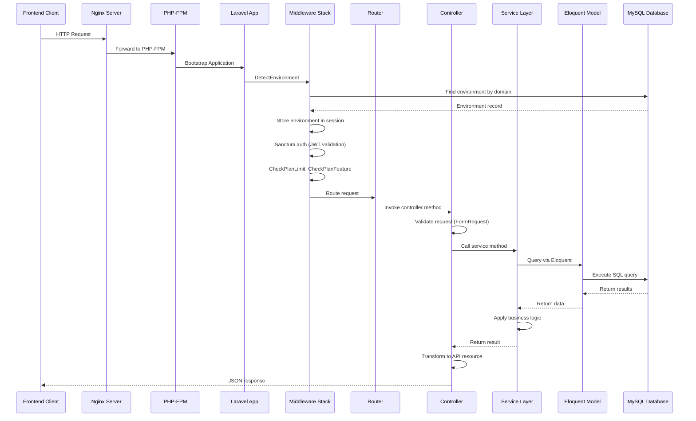

# 11. Backend Architecture

## 11.1 Backend Overview

The CSL platform backend is built on **Laravel 12** (PHP 8.3), following **Domain-Driven Design (DDD)** principles with a clear separation of concerns:

- **Controllers** - HTTP request/response handling, validation
- **Services** - Business logic encapsulation
- **Models** - Eloquent ORM for database interactions
- **Middleware** - Request preprocessing (auth, environment detection, rate limiting)
- **Events/Listeners** - Event-driven architecture for async operations
- **Jobs** - Background task processing via queues
- **Policies** - Authorization logic
- **Providers** - Service container bindings

**Key Architectural Patterns:**
- **Service Layer Pattern** - Business logic in service classes, not controllers
- **Repository Pattern** (limited use) - Data access abstraction for complex queries
- **Factory Pattern** - Payment gateway factory for multiple providers
- **Observer Pattern** - Model events (creating, created, updating, updated)
- **Strategy Pattern** - Commission calculation strategies
- **Singleton Pattern** - Service providers

---

## 11.2 Directory Structure

```
CSL-Certification-Rest-API/
├── app/
│   ├── Console/              # Artisan commands
│   ├── Events/               # Laravel events
│   │   ├── OrderCompleted.php
│   │   ├── CertificateIssued.php
│   │   └── EnvironmentNotification.php
│   ├── Exceptions/           # Custom exceptions
│   ├── Http/
│   │   ├── Controllers/      # HTTP controllers
│   │   │   └── Api/          # API controllers
│   │   ├── Middleware/       # Request middleware
│   │   │   ├── DetectEnvironment.php      # Multi-tenant environment detection
│   │   │   ├── CheckPlanLimit.php         # Subscription limit enforcement
│   │   │   ├── CheckPlanFeature.php       # Feature gating
│   │   │   └── ChatRateLimitMiddleware.php
│   │   └── Requests/         # Form request validation
│   ├── Jobs/                 # Queue jobs (background tasks)
│   ├── Listeners/            # Event listeners
│   ├── Mail/                 # Mailable classes
│   ├── Models/               # Eloquent models
│   │   ├── User.php
│   │   ├── Environment.php
│   │   ├── Course.php
│   │   ├── Order.php
│   │   ├── Transaction.php
│   │   └── ...               # 50+ models
│   ├── Notifications/        # Laravel notifications
│   ├── Observers/            # Model observers
│   ├── Policies/             # Authorization policies
│   ├── Providers/            # Service providers
│   │   ├── AppServiceProvider.php
│   │   ├── AuthServiceProvider.php
│   │   ├── EnvironmentAuthServiceProvider.php  # Multi-tenant auth
│   │   └── EventServiceProvider.php
│   └── Services/             # Business logic services
│       ├── PaymentService.php
│       ├── OrderService.php
│       ├── CertificateGenerationService.php
│       ├── PaymentGateways/  # Payment gateway implementations
│       │   ├── PaymentGatewayFactory.php
│       │   ├── PaymentGatewayInterface.php
│       │   ├── StripeGateway.php
│       │   ├── MonetbillGateway.php
│       │   ├── PayPalGateway.php
│       │   └── LygosGateway.php
│       ├── Commission/
│       │   └── CommissionService.php
│       └── Tax/
│           └── TaxZoneService.php
│
├── bootstrap/
│   └── app.php               # Application bootstrap
│
├── config/                   # Configuration files
│   ├── app.php
│   ├── database.php
│   ├── services.php          # Third-party service configs
│   └── sanctum.php
│
├── database/
│   ├── factories/            # Model factories for testing
│   ├── migrations/           # Database migrations
│   └── seeders/              # Database seeders
│
├── routes/
│   ├── api.php               # API routes
│   ├── web.php               # Web routes (minimal)
│   ├── console.php           # Artisan commands
│   └── channels.php          # Broadcasting channels
│
├── storage/
│   ├── app/                  # Application storage
│   ├── framework/            # Framework cache, sessions
│   └── logs/                 # Application logs
│
├── tests/
│   ├── Feature/              # Feature tests (HTTP, DB)
│   └── Unit/                 # Unit tests (services, models)
│
├── .env                      # Environment variables
├── artisan                   # Artisan CLI
├── composer.json             # PHP dependencies
└── phpunit.xml               # PHPUnit configuration
```

---

## 11.3 Request Lifecycle

**Laravel 12 Request Flow:**



**Key Steps:**
1. **Bootstrap** - Load `.env`, service providers, config
2. **Middleware** - DetectEnvironment → Sanctum auth → Plan limits → Rate limiting
3. **Routing** - Match URL to controller method
4. **Validation** - Form request validation (rules, messages)
5. **Authorization** - Policy checks (can user perform action?)
6. **Service Layer** - Business logic execution
7. **Database** - Eloquent ORM queries
8. **Response** - API resource transformation, JSON response

---

## 11.4 Service Layer Architecture

**Service Pattern:**
- **Purpose:** Encapsulate business logic, keep controllers thin
- **Benefits:** Reusability, testability, separation of concerns
- **Location:** `app/Services/`

**Example: PaymentService.php**
```php
namespace App\Services;

class PaymentService
{
    protected OrderService $orderService;
    protected CommissionService $commissionService;
    protected PaymentGatewayFactory $gatewayFactory;
    protected TaxZoneService $taxZoneService;

    public function __construct(
        OrderService $orderService,
        PaymentGatewayFactory $gatewayFactory,
        CommissionService $commissionService,
        TaxZoneService $taxZoneService
    ) {
        $this->orderService = $orderService;
        $this->commissionService = $commissionService;
        $this->gatewayFactory = $gatewayFactory;
        $this->taxZoneService = $taxZoneService;
    }

    /**
     * Create payment for an order
     */
    public function createPayment(string $orderId, string $paymentMethod, array $paymentData = []): array
    {
        DB::beginTransaction();
        try {
            // Get order
            $order = Order::findOrFail($orderId);

            // Calculate commission
            $commissionAmount = $this->commissionService->calculateCommission($order);

            // Calculate tax
            $taxAmount = $this->taxZoneService->calculateTax($order);

            // Initialize payment gateway
            $gateway = $this->gatewayFactory->make($paymentMethod, $order->environment_id);

            // Create transaction record
            $transaction = Transaction::create([
                'order_id' => $order->id,
                'environment_id' => $order->environment_id,
                'amount' => $order->total_amount,
                'fee_amount' => $commissionAmount,
                'tax_amount' => $taxAmount,
                'status' => 'pending',
            ]);

            // Process payment
            $paymentResult = $gateway->processPayment($transaction, $paymentData);

            DB::commit();
            return $paymentResult;

        } catch (\Exception $e) {
            DB::rollBack();
            Log::error('Payment creation failed', ['error' => $e->getMessage()]);
            throw $e;
        }
    }
}
```

**Service Dependency Injection:**
```php
// Controller uses service via dependency injection
class OrderController extends Controller
{
    protected PaymentService $paymentService;

    public function __construct(PaymentService $paymentService)
    {
        $this->paymentService = $paymentService;
    }

    public function createPayment(Request $request, string $orderId)
    {
        $result = $this->paymentService->createPayment(
            $orderId,
            $request->input('payment_method'),
            $request->input('payment_data', [])
        );

        return response()->json($result);
    }
}
```

---

## 11.5 Multi-Tenant Architecture

**Environment Detection Middleware:**

The CSL platform supports **multi-tenancy** via the `DetectEnvironment` middleware:

```php
// app/Http/Middleware/DetectEnvironment.php
class DetectEnvironment
{
    public function handle(Request $request, Closure $next): Response
    {
        // Detect domain from headers (X-Frontend-Domain, Origin, Referer)
        $domain = $request->header('X-Frontend-Domain')
            ?? parse_url($request->header('Origin'), PHP_URL_HOST)
            ?? parse_url($request->header('Referer'), PHP_URL_HOST);

        // Find environment by domain
        $environment = Environment::where('primary_domain', $domain)
            ->orWhereJsonContains('additional_domains', $domain)
            ->where('is_active', true)
            ->first();

        // Fallback to first active environment
        if (!$environment) {
            $environment = Environment::where('is_active', true)->first();
        }

        // Store environment in session and request
        session(['current_environment_id' => $environment->id]);
        $request->merge(['environment' => $environment]);

        // Associate authenticated user with environment
        if ($request->user()) {
            $request->user()->environments()->syncWithoutDetaching([
                $environment->id => ['joined_at' => now()]
            ]);
        }

        return $next($request);
    }
}
```

**Environment Scoping:**
- All queries automatically scoped by `environment_id`
- Global scope applied to models:
```php
// Example: Automatic environment scoping
Course::where('published', true)->get();
// SQL: SELECT * FROM courses WHERE environment_id = 1 AND published = 1
```

**Environment Isolation:**
- **Data:** Each environment has isolated data (courses, users, orders)
- **Branding:** Custom colors, logos, fonts per environment
- **Payment Gateways:** Separate gateway configurations per environment
- **Subscriptions:** Independent subscription plans and limits

---

## 11.6 Authentication & Authorization

**Laravel Sanctum (JWT Tokens):**

**Token Issuance:**
```php
// POST /api/tokens
public function login(Request $request)
{
    $credentials = $request->validate([
        'email' => 'required|email',
        'password' => 'required',
        'environment_id' => 'required|exists:environments,id',
    ]);

    if (Auth::attempt($credentials)) {
        $user = Auth::user();
        $token = $user->createToken('auth-token', ['*'], now()->addDay())->plainTextToken;

        return response()->json([
            'token' => $token,
            'user' => $user,
            'expires_at' => now()->addDay()->timestamp,
        ]);
    }

    return response()->json(['message' => 'Invalid credentials'], 401);
}
```

**Token Validation (Sanctum Middleware):**
```php
// routes/api.php
Route::middleware('auth:sanctum')->group(function () {
    Route::get('/courses', [CourseController::class, 'index']);
    Route::post('/courses', [CourseController::class, 'store']);
});
```

**Authorization Policies:**
```php
// app/Policies/CoursePolicy.php
class CoursePolicy
{
    public function update(User $user, Course $course): bool
    {
        // Only course creator or admin can update
        return $user->id === $course->user_id || $user->hasRole('admin');
    }

    public function delete(User $user, Course $course): bool
    {
        return $user->id === $course->user_id;
    }
}

// Controller usage
public function update(Request $request, Course $course)
{
    $this->authorize('update', $course); // Throws 403 if fails
    // ... update logic
}
```

**Role-Based Access Control (RBAC):**
```php
// User roles stored in environment_user pivot table
$user->hasRole('admin'); // Check role
$user->hasPermission('manage-courses'); // Check permission
$user->can('update', $course); // Policy check
```

---

## 11.7 Payment Gateway Factory Pattern

**Factory Pattern for Multiple Gateways:**

```php
// app/Services/PaymentGateways/PaymentGatewayFactory.php
class PaymentGatewayFactory
{
    public function make(string $gateway, int $environmentId): PaymentGatewayInterface
    {
        $gatewayClass = match($gateway) {
            'stripe' => StripeGateway::class,
            'monetbil' => MonetbillGateway::class,
            'paypal' => PayPalGateway::class,
            'lygos' => LygosGateway::class,
            default => throw new \Exception("Unsupported gateway: $gateway"),
        };

        return app($gatewayClass, ['environmentId' => $environmentId]);
    }
}

// PaymentGatewayInterface
interface PaymentGatewayInterface
{
    public function processPayment(Transaction $transaction, array $paymentData): array;
    public function verifyWebhook(Request $request): bool;
    public function handleWebhook(Request $request): void;
    public function refundPayment(Transaction $transaction, float $amount): array;
}

// StripeGateway implementation
class StripeGateway implements PaymentGatewayInterface
{
    protected PaymentGatewaySetting $settings;
    protected \Stripe\StripeClient $stripe;

    public function __construct(int $environmentId)
    {
        $this->settings = PaymentGatewaySetting::where('environment_id', $environmentId)
            ->where('gateway_code', 'stripe')
            ->firstOrFail();

        $this->stripe = new \Stripe\StripeClient($this->settings->api_key);
    }

    public function processPayment(Transaction $transaction, array $paymentData): array
    {
        $paymentIntent = $this->stripe->paymentIntents->create([
            'amount' => $transaction->total_amount * 100, // cents
            'currency' => $transaction->currency,
            'metadata' => [
                'transaction_id' => $transaction->id,
                'order_id' => $transaction->order_id,
            ],
        ]);

        return [
            'status' => 'processing',
            'client_secret' => $paymentIntent->client_secret,
            'payment_intent_id' => $paymentIntent->id,
        ];
    }
}
```

**Supported Gateways:**
- Stripe (credit cards, global)
- MonetBil (mobile money, Cameroon)
- PayPal (wallet payments)
- Lygos (regional African gateway)
- FlutterWave, CinetPay, Dohone, CamPay (additional African gateways)

---

## 11.8 Event-Driven Architecture

**Laravel Events & Listeners:**

**Event Definition:**
```php
// app/Events/OrderCompleted.php
class OrderCompleted
{
    use Dispatchable, InteractsWithSockets, SerializesModels;

    public Order $order;
    public User $user;

    public function __construct(Order $order, User $user)
    {
        $this->order = $order;
        $this->user = $user;
    }
}
```

**Event Listener:**
```php
// app/Listeners/SendOrderConfirmationEmail.php
class SendOrderConfirmationEmail
{
    public function handle(OrderCompleted $event): void
    {
        Mail::to($event->user->email)->send(
            new OrderConfirmationMail($event->order)
        );
    }
}

// app/Listeners/EnrollUserInCourse.php
class EnrollUserInCourse
{
    public function handle(OrderCompleted $event): void
    {
        foreach ($event->order->items as $item) {
            if ($item->product->type === 'course') {
                Enrollment::create([
                    'user_id' => $event->user->id,
                    'course_id' => $item->product->course_id,
                    'order_id' => $event->order->id,
                    'environment_id' => $event->order->environment_id,
                ]);
            }
        }
    }
}
```

**Event Registration:**
```php
// app/Providers/EventServiceProvider.php
class EventServiceProvider extends ServiceProvider
{
    protected $listen = [
        OrderCompleted::class => [
            SendOrderConfirmationEmail::class,
            EnrollUserInCourse::class,
            UpdateInventory::class,
            NotifyAdmin::class,
        ],
        CertificateIssued::class => [
            SendCertificateEmail::class,
            LogCertificateIssuance::class,
        ],
    ];
}
```

**Event Dispatching:**
```php
// In controller or service
event(new OrderCompleted($order, $user));
// or
OrderCompleted::dispatch($order, $user);
```

---

## 11.9 Queue & Job Processing

**Background Jobs (RabbitMQ):**

**Job Definition:**
```php
// app/Jobs/GenerateCertificate.php
class GenerateCertificate implements ShouldQueue
{
    use Dispatchable, InteractsWithQueue, Queueable, SerializesModels;

    public int $tries = 3;
    public int $timeout = 120; // 2 minutes

    protected Enrollment $enrollment;

    public function __construct(Enrollment $enrollment)
    {
        $this->enrollment = $enrollment;
    }

    public function handle(CertificateGenerationService $service): void
    {
        $certificate = $service->generate($this->enrollment);

        // Fire event
        event(new CertificateIssued($certificate));
    }

    public function failed(\Throwable $exception): void
    {
        Log::error('Certificate generation failed', [
            'enrollment_id' => $this->enrollment->id,
            'error' => $exception->getMessage(),
        ]);
    }
}
```

**Job Dispatching:**
```php
// Dispatch immediately
GenerateCertificate::dispatch($enrollment);

// Dispatch with delay
GenerateCertificate::dispatch($enrollment)->delay(now()->addMinutes(5));

// Dispatch to specific queue
GenerateCertificate::dispatch($enrollment)->onQueue('certificates');
```

**Queue Configuration:**
```php
// config/queue.php
'connections' => [
    'rabbitmq' => [
        'driver' => 'rabbitmq',
        'queue' => 'default',
        'connection' => [
            'host' => env('RABBITMQ_HOST', 'localhost'),
            'port' => env('RABBITMQ_PORT', 5672),
            'user' => env('RABBITMQ_USER', 'guest'),
            'password' => env('RABBITMQ_PASSWORD', 'guest'),
            'vhost' => env('RABBITMQ_VHOST', '/'),
        ],
    ],
],
```

**Queue Worker:**
```bash