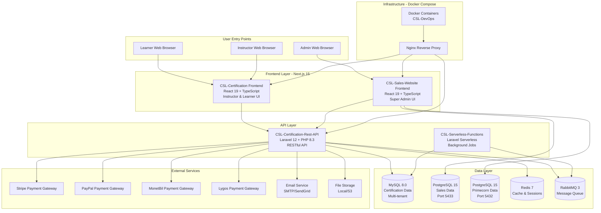

# 2. High Level Architecture

## 2.1 Technical Summary

CSL is a distributed **multi-tenant SaaS platform** built using:
- **Backend:** Laravel 12 REST API (PHP 8.3)
- **Frontends:** Next.js 15 + React 19 (TypeScript)
- **Databases:** MySQL 8.0 (certification data) + PostgreSQL 15 (sales/admin data)
- **Infrastructure:** Docker Compose orchestration
- **Architecture Style:** Polyrepo (5 separate Git repositories)
- **Deployment:** Self-hosted on VPS/cloud infrastructure

## 2.2 Platform Choice

**Platform:** Self-hosted Docker Infrastructure
**Key Services:**
- Docker Compose for container orchestration
- MySQL 8.0 for multi-tenant certification data
- PostgreSQL 15 for sales and admin data (2 instances)
- Redis 7 for caching and session storage
- RabbitMQ 3 for asynchronous message processing
- Nginx as reverse proxy and load balancer

**Deployment Host and Regions:**
- Primary: VPS/Cloud Infrastructure (self-hosted)
- No specific cloud provider dependency (portable)
- Docker-based deployment allows easy migration between providers

**Rationale:** Self-hosted infrastructure provides:
- Full control over data and infrastructure
- No vendor lock-in to specific cloud providers
- Cost-effective for multi-tenant SaaS model
- Flexibility to scale horizontally with Docker Swarm or Kubernetes in future

## 2.3 Repository Structure

**Structure:** Polyrepo (5 independent Git repositories)
**Monorepo Tool:** N/A - Each service is independently deployable
**Package Organization:**
```
CSL-Certification-Rest-API/       # Laravel 12 REST API (backend)
CSL-Sales-Website/                # Next.js 15 Admin Frontend (PostgreSQL)
CSL-Certification/                # Next.js 15 Instructor/Learner Frontend
CSL-Serverless-Functions/         # Laravel Serverless Functions
CSL-DevOps/                       # Docker Compose infrastructure
```

**Rationale for Polyrepo:**
- Each service has independent deployment lifecycle
- Clear ownership boundaries (backend, admin, learner, infrastructure)
- Allows different teams to work on different services independently
- Simpler CI/CD pipelines per service
- Existing production architecture (brownfield constraint)

## 2.4 High Level Architecture Diagram



## 2.5 Architectural Patterns

- **Multi-Tenant Architecture:** Single codebase serving multiple isolated environments (organizations) via `environment_id` scoping - _Rationale:_ Efficient resource utilization and simplified maintenance for SaaS platform

- **Service Layer Pattern:** Business logic encapsulated in dedicated service classes (e.g., `PaymentService`, `CommissionService`) - _Rationale:_ Separates business logic from controllers, improves testability and maintainability

- **Repository Pattern:** Data access abstraction through Eloquent models and custom repositories - _Rationale:_ Enables future database migration and simplifies testing with mock repositories

- **Component-Based UI:** Reusable React 19 components with TypeScript interfaces - _Rationale:_ Type safety, maintainability, and reusability across large frontend codebases

- **RESTful API Design:** HTTP/JSON API following REST principles with Laravel API Resources - _Rationale:_ Industry standard, widely understood, excellent tooling support

- **Factory Pattern:** Payment gateway factory for multi-gateway support (`GatewayFactory::create($gatewayCode)`) - _Rationale:_ Extensible payment processing supporting 4+ gateways without code duplication

- **Event-Driven Architecture:** Laravel events and RabbitMQ for asynchronous operations - _Rationale:_ Decouples components, improves scalability, handles background jobs efficiently

- **Server-Side Rendering (SSR):** Next.js App Router with React Server Components - _Rationale:_ Improved SEO, faster initial page load, better performance for dynamic content

- **Middleware Pattern:** Laravel middleware for authentication, authorization, and environment scoping - _Rationale:_ Cross-cutting concerns handled consistently across all API endpoints

- **Feature Flag Pattern:** Opt-in centralized payment gateway via `use_centralized_gateways` flag - _Rationale:_ Safe rollout of new features, easy rollback, gradual adoption across environments

---
