# 6. Components

## 6.1 Component Architecture Overview

The CSL platform follows a **layered component architecture** with clear separation between frontend UI components, backend services, and external integrations. Components are organized by responsibility, with well-defined interfaces and minimal coupling.

**Architecture Principles:**
- **Single Responsibility:** Each component has one clear purpose
- **Dependency Injection:** Services are injected via constructors (Laravel) or React Context/Props (Next.js)
- **Interface-Based Design:** Components depend on interfaces, not concrete implementations
- **Reusability:** UI components are composable, services are stateless where possible
- **Testability:** Components are designed for unit and integration testing

---

## 6.2 Backend Components (Laravel)

### 6.2.1 PaymentService

**Responsibility:** Core payment processing orchestration, gateway selection, transaction management

**Key Interfaces:**
- `initializeGateway(int $environmentId, string $gateway = null): PaymentGatewayInterface` - Select and initialize payment gateway
- `processPayment(Order $order, array $paymentDetails): Transaction` - Process payment for order
- `handleCallback(string $gateway, string $status, array $data): void` - Handle payment gateway callbacks
- `refundPayment(Transaction $transaction, float $amount): bool` - Process refund

**Dependencies:**
- `PaymentGatewayFactory` - Creates gateway instances
- `CommissionService` - Calculate platform fees
- `TaxZoneService` - Calculate taxes
- `EnvironmentPaymentConfigService` - Check centralized gateway settings (NEW from epic)
- `OrderService` - Order management

**Technology Stack:**
- Laravel 12 service class
- Factory pattern for gateway selection
- Database transactions for atomic operations
- Event dispatching for async operations (OrderPaymentProcessed event)

**File:** `app/Services/PaymentService.php` (56KB)

---

### 6.2.2 CommissionService

**Responsibility:** Platform fee calculation and commission rate management

**Key Interfaces:**
- `extractCommissionFromProductPrice(float $price, ?int $environmentId): array` - Calculate commission from gross price
- `calculateTransactionAmountsWithCommissionIncluded(float $price, ?int $environmentId, ?Order $order): array` - Full transaction breakdown
- `getCommissionRate(int $environmentId): float` - Get commission rate for environment

**Dependencies:**
- `Commission` model - Platform fee rate configuration
- `Environment` model - Environment-specific settings

**Technology Stack:**
- Laravel 12 service class
- Eloquent ORM for database access
- Redis caching for commission rates (TTL: 1 hour)

**File:** `app/Services/Commission/CommissionService.php`

**NOTE:** This service handles PLATFORM FEE RATES, not instructor payouts.

---

### 6.2.3 EnvironmentPaymentConfigService (NEW)

**Responsibility:** Manage opt-in settings for centralized payment gateway system

**Key Interfaces:**
- `getConfig(int $environmentId): ?EnvironmentPaymentConfig` - Get payment config for environment (cached)
- `updateConfig(int $environmentId, array $data): EnvironmentPaymentConfig` - Update payment config
- `enableCentralizedPayments(int $environmentId): bool` - Enable centralized gateways
- `disableCentralizedPayments(int $environmentId): bool` - Disable centralized gateways
- `isCentralized(int $environmentId): bool` - Check if environment uses centralized gateways
- `getDefaultConfig(): array` - Get default configuration values

**Dependencies:**
- `EnvironmentPaymentConfig` model
- Redis cache

**Technology Stack:**
- Laravel 12 service class
- Redis caching (key: `env_payment_config:{environment_id}`, TTL: 1 hour)
- Cache invalidation on config update

**File:** `app/Services/EnvironmentPaymentConfigService.php` (to be created in Story 2)

---

### 6.2.4 InstructorCommissionService (NEW)

**Responsibility:** Track instructor earnings, calculate balances, manage commission records

**Key Interfaces:**
- `createCommissionRecord(Transaction $transaction): InstructorCommission` - Create commission record on successful transaction
- `calculateNetEarnings(int $environmentId): float` - Calculate instructor's net earnings
- `getTotalEarned(int $environmentId): float` - Total gross earnings
- `getTotalPaid(int $environmentId): float` - Total paid out
- `getAvailableBalance(int $environmentId): float` - Available balance for withdrawal
- `getCommissions(int $environmentId, array $filters): Collection` - Filtered commission list
- `approveCommission(InstructorCommission $commission): bool` - Approve commission for payout

**Dependencies:**
- `InstructorCommission` model
- `Transaction` model
- `Order` model
- `EnvironmentPaymentConfig` model

**Technology Stack:**
- Laravel 12 service class
- Eloquent ORM with relationships
- Redis caching for balance calculations

**File:** `app/Services/InstructorCommissionService.php` (to be created in Story 3)

---

### 6.2.5 WithdrawalService (NEW)

**Responsibility:** Handle withdrawal requests, validate balances, process payouts

**Key Interfaces:**
- `createWithdrawalRequest(int $environmentId, float $amount, array $details): WithdrawalRequest` - Create withdrawal request
- `approveWithdrawal(WithdrawalRequest $request): bool` - Approve withdrawal (admin action)
- `rejectWithdrawal(WithdrawalRequest $request, string $reason): bool` - Reject withdrawal (admin action)
- `processWithdrawal(WithdrawalRequest $request, string $reference): bool` - Mark as paid
- `getAvailableBalance(int $environmentId): float` - Check available balance
- `validateWithdrawalAmount(int $environmentId, float $amount): bool` - Validate withdrawal amount

**Dependencies:**
- `WithdrawalRequest` model
- `InstructorCommissionService` - Check available balance
- `EnvironmentPaymentConfig` - Check minimum withdrawal amount

**Technology Stack:**
- Laravel 12 service class
- Database transactions for atomic operations
- Event dispatching (WithdrawalRequestCreated, WithdrawalApproved events)

**File:** `app/Services/WithdrawalService.php` (to be created in Story 3)

---

### 6.2.6 PaymentGatewayFactory

**Responsibility:** Create payment gateway instances based on gateway code

**Key Interfaces:**
- `create(string $gatewayCode, PaymentGatewaySetting $settings): PaymentGatewayInterface` - Factory method

**Dependencies:**
- `StripeGateway`, `PayPalGateway`, `MonetbillGateway`, `LygosGateway` (concrete implementations)
- `PaymentGatewayInterface` - Common interface for all gateways

**Technology Stack:**
- Laravel 12 service class
- Factory pattern
- Interface-based design

**File:** `app/Services/PaymentGateways/PaymentGatewayFactory.php`

---

### 6.2.7 BrandingService

**Responsibility:** Manage environment-specific branding (colors, logos, fonts)

**Key Interfaces:**
- `getBranding(int $environmentId): ?array` - Get branding configuration
- `updateBranding(int $environmentId, array $data): array` - Update branding
- `resetBranding(int $environmentId): array` - Reset to default branding
- `previewBranding(array $data): array` - Preview branding changes

**Dependencies:**
- `Environment` model (branding_data JSON column)

**Technology Stack:**
- Laravel 12 service class
- JSON storage in MySQL
- Redis caching for branding data

**File:** `app/Services/BrandingService.php`

---

### 6.2.8 CertificateGenerationService

**Responsibility:** Generate PDF certificates for course completions

**Key Interfaces:**
- `generateCertificate(int $enrollmentId, int $certificateTemplateId): string` - Generate certificate PDF
- `issueCertificate(int $certificateContentId, int $enrollmentId): Certificate` - Issue certificate
- `verifyCertificate(string $certificateCode): ?Certificate` - Verify certificate authenticity

**Dependencies:**
- `Certificate` model
- `Enrollment` model
- `CertificateTemplate` model
- `DomPDF` - PDF generation library

**Technology Stack:**
- Laravel 12 service class
- DomPDF for PDF generation
- File storage (local or S3)

**File:** `app/Services/CertificateGenerationService.php`

---

## 6.3 Frontend Components (Next.js)

### 6.3.1 AuthProvider (Context Provider)

**Responsibility:** Manage authentication state, token storage, user session

**Key Interfaces:**
- `useAuth(): AuthContextType` - Hook to access auth state
- `login(email: string, password: string): Promise<void>` - Login user
- `logout(): Promise<void>` - Logout user
- `refreshUser(): Promise<void>` - Refresh user data

**Dependencies:**
- Redux store (`authSlice`)
- REST API (`/api/tokens`, `/api/user`)
- localStorage (token storage)

**Technology Stack:**
- React 19 Context API
- Redux Toolkit for state management
- TypeScript interfaces
- JWT token handling

**File:** `components/auth/auth-provider.tsx` (CSL-Certification)

---

### 6.3.2 UI Component Library (Radix UI + TailwindCSS)

**Responsibility:** Reusable, accessible UI primitives and styled components

**Key Components:**
- `Button`, `Input`, `Select`, `Dialog`, `Sheet`, `Drawer` - Form controls
- `Card`, `Badge`, `Avatar`, `Skeleton` - Layout and display
- `DataTable`, `Pagination`, `Tabs`, `Accordion` - Complex components
- `Toast`, `AlertDialog`, `ContextMenu` - Feedback and interactions
- `Calendar`, `DateRangePicker`, `FileUpload` - Advanced inputs

**Dependencies:**
- Radix UI headless components
- TailwindCSS for styling
- lucide-react for icons

**Technology Stack:**
- React 19 components
- TypeScript with strict typing
- Radix UI primitives
- TailwindCSS utility classes
- Composable component patterns

**Files:** `components/ui/*.tsx` (60+ components in CSL-Certification)

---

### 6.3.3 Data Table Component

**Responsibility:** Reusable data table with sorting, filtering, pagination

**Key Interfaces:**
- `DataTable<TData, TValue>` - Generic data table component
- Props: `columns`, `data`, `pageSize`, `onRowClick`, `isLoading`

**Dependencies:**
- `@tanstack/react-table` - Headless table library
- UI components (Button, Input, Select, Pagination)

**Technology Stack:**
- React 19 component
- TypeScript generics for type safety
- TanStack Table v8 for table logic
- Server-side pagination support

**Files:**
- `components/ui/data-table/data-table.tsx`
- `components/ui/data-table/utils.tsx`
- `components/ui/data-table/index.tsx`

---

### 6.3.4 Course Management Components

**Responsibility:** Create, edit, and manage courses (instructor interface)

**Key Components:**
- `CourseCard` - Display course summary
- `CourseSectionManager` - Manage course sections
- `BlocksManagement` - Manage course blocks (units)
- `ActivityCard` - Display activity summary
- `CreateActivityDialog` - Create new activity modal

**Dependencies:**
- REST API (`/api/courses`, `/api/sections`, `/api/blocks`, `/api/activities`)
- Redux or SWR for data fetching
- TipTap editor for rich text content

**Technology Stack:**
- React 19 components
- Next.js App Router pages
- SWR for data fetching and caching
- TipTap editor integration

**Files:**
- `components/courses/course-card.tsx`
- `components/blocks-management.tsx`
- `components/activities/activity-card.tsx`
- `components/activities/create-activity-dialog.tsx`

---

### 6.3.5 Payment Components

**Responsibility:** Checkout flow, payment method selection, order confirmation

**Key Components:**
- `CheckoutForm` - Multi-step checkout form
- `PaymentMethodSelector` - Select payment gateway
- `OrderSummary` - Display order details
- `OrderConfirmation` - Post-payment confirmation

**Dependencies:**
- REST API (`/api/storefront/{environmentId}/checkout`)
- Payment gateway SDKs (Stripe.js, PayPal SDK)
- Cart state management

**Technology Stack:**
- React 19 components
- Form validation (React Hook Form + Zod)
- Payment gateway client-side SDKs
- Redirect-based payment flow

**Files:**
- `app/checkout/components/*.tsx` (CSL-Certification)

---

### 6.3.6 Admin Commission Management Components (NEW)

**Responsibility:** Admin UI for viewing and approving instructor commissions

**Key Components:**
- `CommissionTable` - Paginated commission list with filters
- `CommissionStatsCards` - Statistics cards (total owed, paid, pending)
- `BulkApproveButton` - Approve multiple commissions
- `CommissionDetailsModal` - View commission breakdown

**Dependencies:**
- REST API (`/api/admin/commissions/*`)
- DataTable component
- UI components (Card, Button, Dialog, Badge)

**Technology Stack:**
- React 19 components
- Next.js App Router pages
- SWR for data fetching
- CSV export functionality

**Files:** `app/admin/commissions/*.tsx` (CSL-Sales-Website - to be created in Story 6)

---

### 6.3.7 Admin Withdrawal Management Components (NEW)

**Responsibility:** Admin UI for approving and processing withdrawal requests

**Key Components:**
- `WithdrawalTable` - Paginated withdrawal request list
- `WithdrawalActions` - Approve/Reject/Process buttons
- `WithdrawalDetailsModal` - View withdrawal details and commission breakdown
- `RejectModal` - Input rejection reason
- `ProcessPaymentModal` - Input payment reference

**Dependencies:**
- REST API (`/api/admin/withdrawal-requests/*`)
- DataTable component
- Form components

**Technology Stack:**
- React 19 components
- React Hook Form for form handling
- Zod for validation
- Toast notifications for feedback

**Files:** `app/admin/withdrawals/*.tsx` (CSL-Sales-Website - to be created in Story 6)

---

### 6.3.8 Instructor Earnings Components (NEW)

**Responsibility:** Instructor UI for viewing earnings and commission history

**Key Components:**
- `EarningsTable` - Commission history table
- `EarningsStatsCards` - Stats cards (total earned, paid, available balance)
- `DownloadStatementsButton` - Export earnings to PDF/CSV

**Dependencies:**
- REST API (`/api/instructor/earnings/*`)
- DataTable component
- PDF generation (client-side or API)

**Technology Stack:**
- React 19 components
- Next.js App Router pages
- SWR for data fetching
- Chart.js or Recharts for visualizations

**Files:** `app/instructor/earnings/*.tsx` (CSL-Certification - to be created in Story 7)

---

### 6.3.9 Instructor Withdrawal Components (NEW)

**Responsibility:** Instructor UI for requesting withdrawals

**Key Components:**
- `WithdrawalForm` - Request withdrawal form
- `WithdrawalHistoryTable` - Withdrawal request history
- `WithdrawalRequestModal` - Create withdrawal request modal

**Dependencies:**
- REST API (`/api/instructor/withdrawals/*`)
- Form validation (React Hook Form + Zod)
- Balance check before submission

**Technology Stack:**
- React 19 components
- Form handling with validation
- Real-time balance display

**Files:** `app/instructor/withdrawals/*.tsx` (CSL-Certification - to be created in Story 7)

---

## 6.4 Component Interaction Diagram

```mermaid
graph TB
    subgraph "Frontend - Next.js"
        UI[UI Components<br/>Radix UI + TailwindCSS]
        AuthProvider[AuthProvider<br/>Context]
        DataTable[DataTable<br/>Generic Component]
        AdminCommissionUI[Admin Commission UI<br/>NEW]
        AdminWithdrawalUI[Admin Withdrawal UI<br/>NEW]
        InstructorEarningsUI[Instructor Earnings UI<br/>NEW]
        InstructorWithdrawalUI[Instructor Withdrawal UI<br/>NEW]
    end

    subgraph "Backend Services - Laravel"
        PaymentService[PaymentService<br/>Payment Orchestration]
        CommissionService[CommissionService<br/>Platform Fee Calculation]
        EnvPaymentConfigService[EnvironmentPaymentConfigService<br/>NEW - Centralized Gateway Config]
        InstructorCommissionService[InstructorCommissionService<br/>NEW - Instructor Earnings]
        WithdrawalService[WithdrawalService<br/>NEW - Withdrawal Management]
        PaymentGatewayFactory[PaymentGatewayFactory<br/>Gateway Selection]
        BrandingService[BrandingService<br/>Environment Branding]
        CertificateService[CertificateGenerationService<br/>PDF Generation]
    end

    subgraph "Payment Gateways"
        StripeGateway[StripeGateway]
        PayPalGateway[PayPalGateway]
        MonetbillGateway[MonetbillGateway]
        LygosGateway[LygosGateway]
    end

    subgraph "Data Layer"
        Models[Eloquent Models<br/>User, Environment, Order, Transaction, etc.]
        RedisCache[Redis Cache<br/>Config, Balances]
    end

    %% Frontend to Backend
    UI --> AuthProvider
    AdminCommissionUI --> DataTable
    AdminWithdrawalUI --> DataTable
    InstructorEarningsUI --> DataTable
    InstructorWithdrawalUI --> UI

    AuthProvider -->|REST API| PaymentService
    AdminCommissionUI -->|REST API| InstructorCommissionService
    AdminWithdrawalUI -->|REST API| WithdrawalService
    InstructorEarningsUI -->|REST API| InstructorCommissionService
    InstructorWithdrawalUI -->|REST API| WithdrawalService

    %% Backend Service Dependencies
    PaymentService --> CommissionService
    PaymentService --> EnvPaymentConfigService
    PaymentService --> PaymentGatewayFactory

    InstructorCommissionService --> EnvPaymentConfigService
    WithdrawalService --> InstructorCommissionService
    WithdrawalService --> EnvPaymentConfigService

    PaymentGatewayFactory --> StripeGateway
    PaymentGatewayFactory --> PayPalGateway
    PaymentGatewayFactory --> MonetbillGateway
    PaymentGatewayFactory --> LygosGateway

    %% Backend to Data
    PaymentService --> Models
    CommissionService --> Models
    EnvPaymentConfigService --> Models
    EnvPaymentConfigService --> RedisCache
    InstructorCommissionService --> Models
    InstructorCommissionService --> RedisCache
    WithdrawalService --> Models
    BrandingService --> Models
    CertificateService --> Models
```

---

## 6.5 Component Design Patterns

**Backend Patterns:**
- **Service Layer Pattern:** All business logic in service classes, controllers are thin
- **Factory Pattern:** `PaymentGatewayFactory` creates gateway instances
- **Interface-Based Design:** `PaymentGatewayInterface` allows multiple gateway implementations
- **Repository Pattern:** Complex queries abstracted in repository classes
- **Event-Driven:** Laravel events for async operations (OrderPaymentProcessed, WithdrawalApproved)

**Frontend Patterns:**
- **Component Composition:** Small, focused components composed into complex UIs
- **Container/Presenter Pattern:** Smart containers (data fetching) + dumb presenters (UI rendering)
- **Render Props & Hooks:** Reusable logic via custom hooks (useAuth, useToast)
- **Context API:** Global state management (auth, theme, branding)
- **Server Components:** Next.js 15 React Server Components for data fetching

---

---
