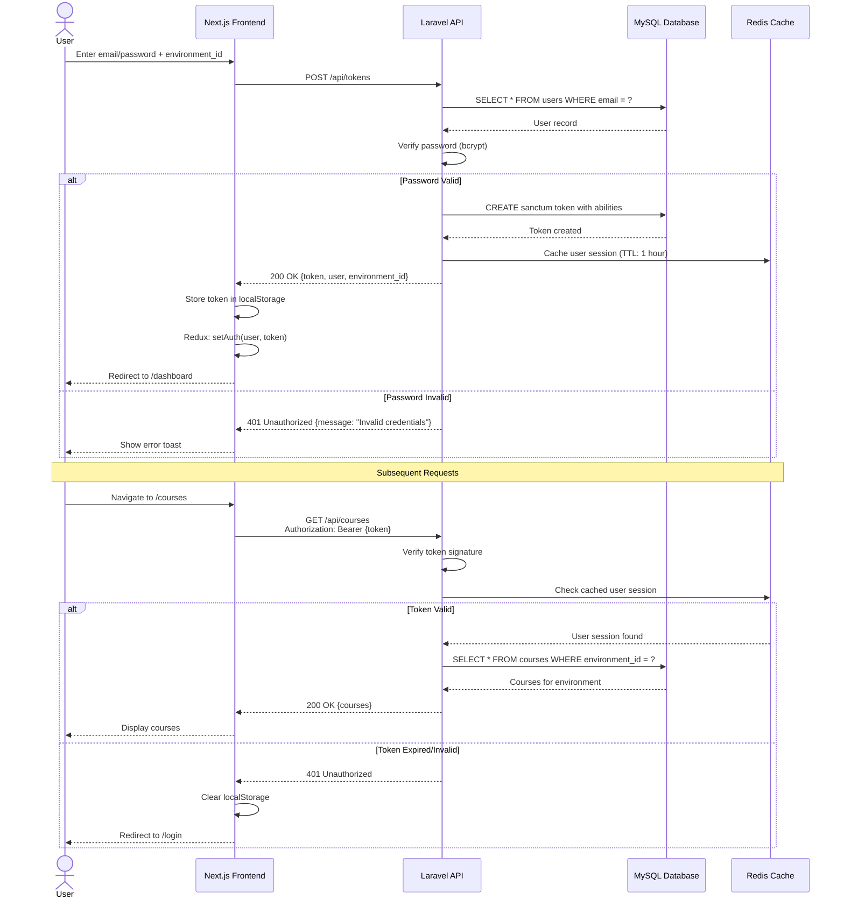
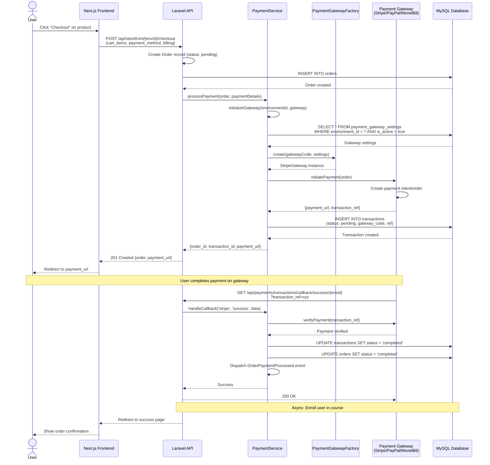
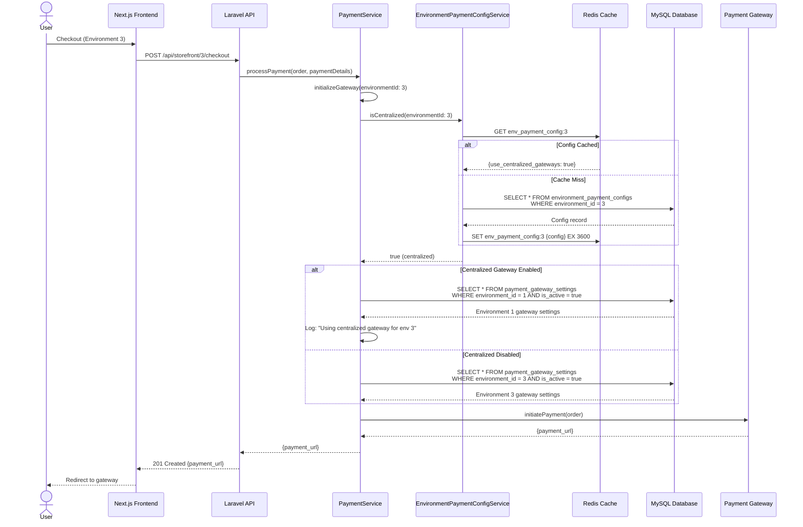
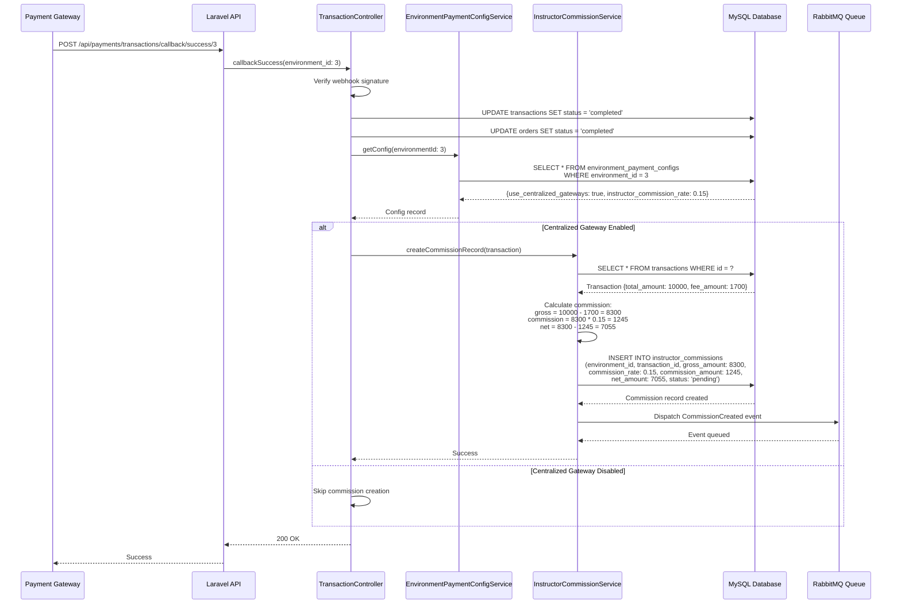
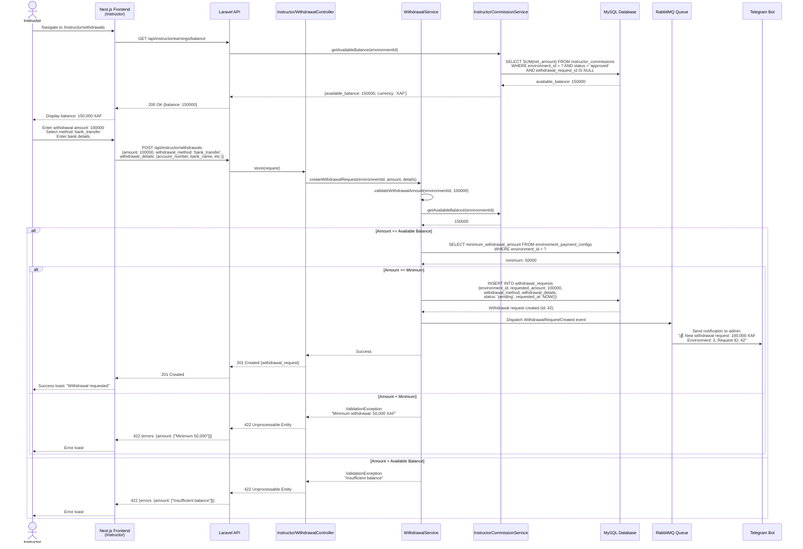
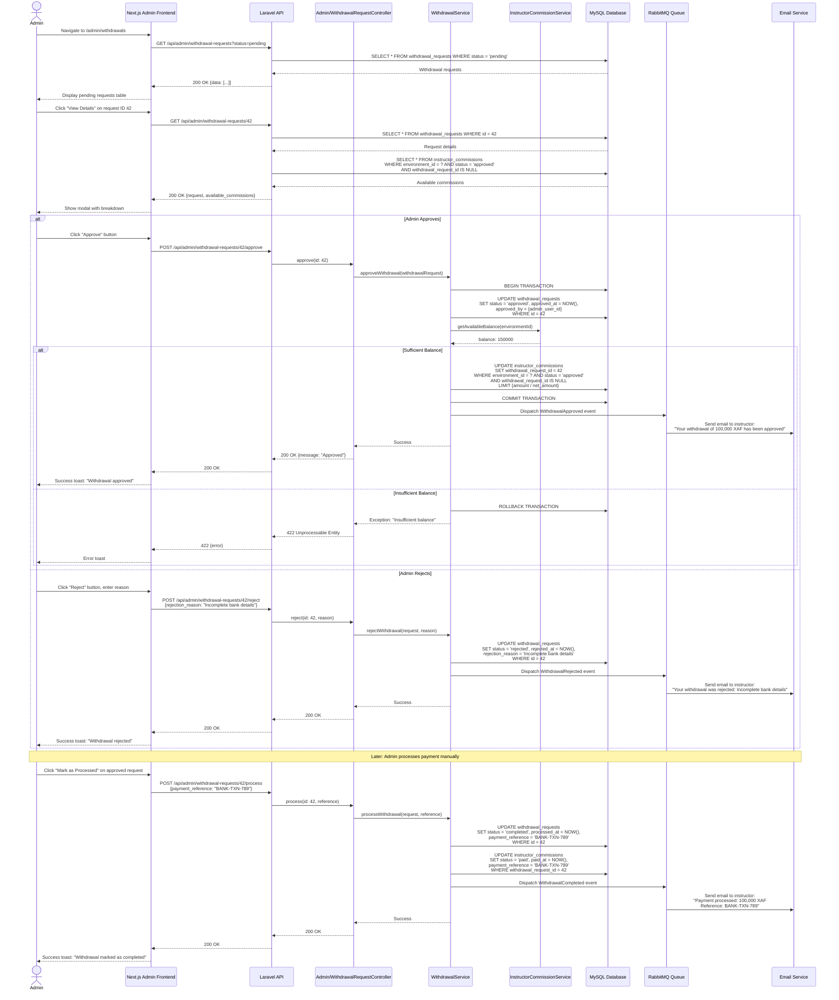
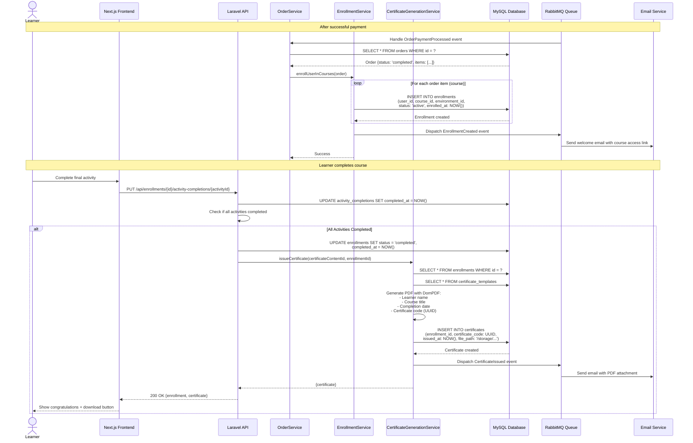
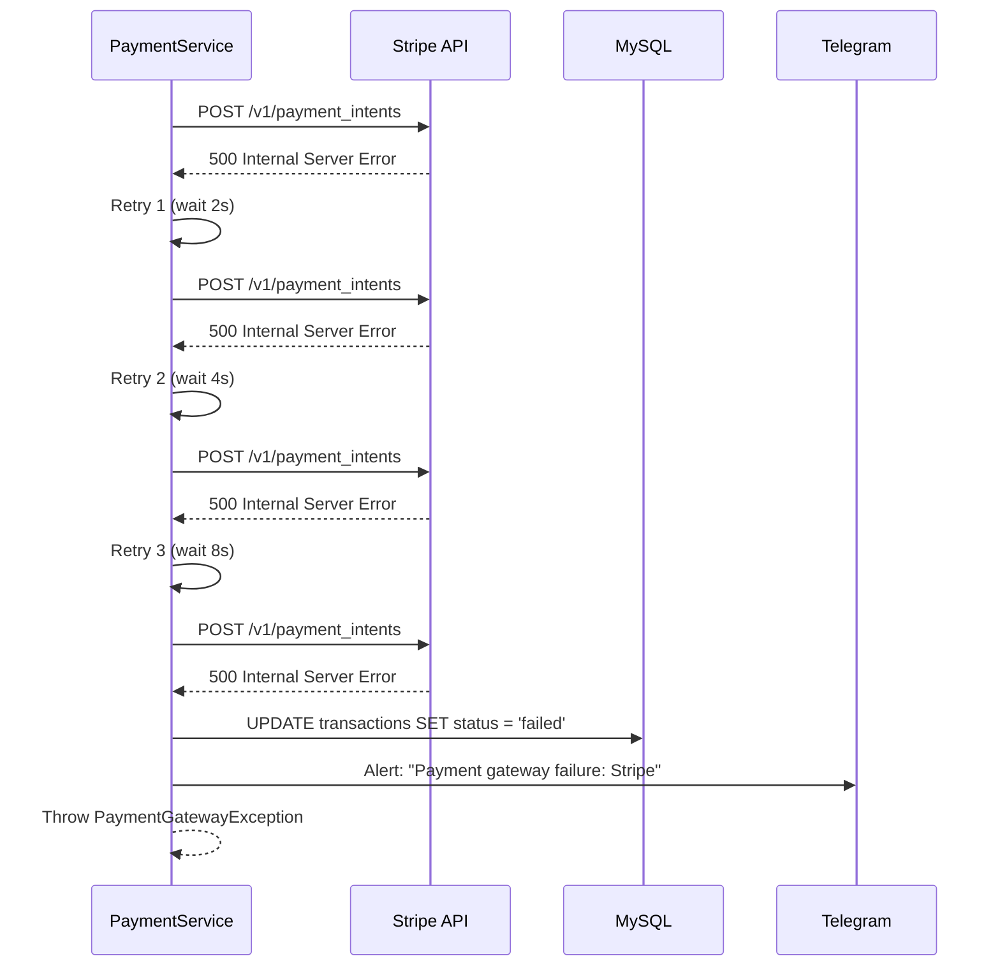
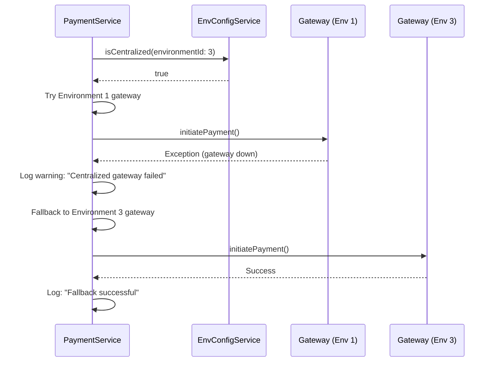

# 8. Core Workflows

## 8.1 Workflow Overview

This section documents the critical user journeys and system workflows in the CSL platform. Each workflow is illustrated with sequence diagrams showing component interactions, error handling, and async operations.

**Key Workflows:**
1. User Authentication Flow
2. Course Checkout & Payment Flow (Existing)
3. Centralized Payment Gateway Routing (NEW - Payment Gateway Epic)
4. Commission Record Creation (NEW - Payment Gateway Epic)
5. Instructor Withdrawal Request Flow (NEW - Payment Gateway Epic)
6. Admin Withdrawal Approval Flow (NEW - Payment Gateway Epic)
7. Course Enrollment & Certificate Generation

---

## 8.2 User Authentication Flow

**Key Points:**
- JWT tokens include `environment_id:{id}` ability for multi-tenant scoping
- Tokens cached in Redis for fast validation (TTL: 1 hour)
- Automatic logout on token expiry (frontend detects 401 and clears session)

---

## 8.3 Course Checkout & Payment Flow (Existing)

**Key Points:**
- Order created with 'pending' status before payment
- Transaction records payment attempt with gateway reference
- Payment processed on external gateway (redirect flow)
- Webhook callback verifies payment and updates status
- Laravel events trigger async operations (enrollment, email)

---

## 8.4 Centralized Payment Gateway Routing (NEW)

**Key Points:**
- **Opt-in logic**: Check `EnvironmentPaymentConfigService.isCentralized()`
- **Caching**: Config cached in Redis (TTL: 1 hour) to avoid DB queries
- **Routing decision**: If centralized, use Environment 1's gateway; else use environment's own gateway
- **Logging**: All centralized routing logged for auditing
- **Backward compatible**: Existing environments continue using own gateways unless opted-in

---

## 8.5 Commission Record Creation (NEW)

**Key Points:**
- Commission record ONLY created for environments using centralized gateways
- Calculation: `gross_amount = total - platform_fee`, `net_amount = gross - instructor_commission`
- Initial status: 'pending' (requires admin approval before withdrawal)
- Event dispatched for async notifications (email to instructor about earnings)

---

## 8.6 Instructor Withdrawal Request Flow (NEW)

**Key Points:**
- Available balance = SUM of approved commissions NOT yet withdrawn
- Validation: Amount >= minimum_withdrawal_amount AND <= available_balance
- Status: 'pending' (awaits admin approval)
- Telegram notification sent to admin immediately (via queued job)
- Withdrawal details encrypted before storage (bank account numbers)

---

## 8.7 Admin Withdrawal Approval Flow (NEW)

**Key Points:**
- Three-step approval process: pending → approved → processing → completed
- Database transaction ensures atomicity (approve + link commissions)
- Commission records linked to withdrawal request (prevents double-payout)
- Email notifications at each stage (approved, rejected, completed)
- Payment reference stored for audit trail (bank transaction ID)

---

## 8.8 Course Enrollment & Certificate Generation

**Key Points:**
- Enrollment created asynchronously after payment (via queue)
- Certificate generated only when ALL activities completed
- Certificate code (UUID) for verification via public API
- PDF stored in `storage/app/public/certificates` or S3
- Email with certificate PDF attachment sent automatically

---

## 8.9 Error Handling Patterns

**Payment Gateway Failure:**

**Fallback to Environment Gateway (Centralized Failure):**

---

---
