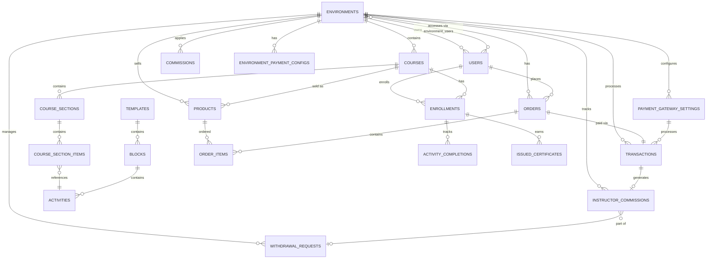

# 9. Database Schema

## 9.1 Database Overview

**Database Management System:** MySQL 8.0
**Character Set:** utf8mb4 (full Unicode support, including emojis)
**Collation:** utf8mb4_unicode_ci
**Storage Engine:** InnoDB (ACID compliance, foreign key support)

**Schema Organization:**
- **Total Tables:** 50+ tables (existing) + 3 NEW tables (Payment Gateway Epic)
- **Multi-Tenancy:** All tables scoped by `environment_id` foreign key
- **Soft Deletes:** Most tables use `deleted_at` for safe data recovery
- **Timestamps:** All tables have `created_at` and `updated_at`
- **UUIDs:** Critical entities (transactions, certificates) use UUID for external reference

---

## 9.2 Entity Relationship Diagram (Core Entities)



---

## 9.3 Core Tables

### 9.3.1 environments

Multi-tenant organization containers.

```sql
CREATE TABLE `environments` (
  `id` BIGINT UNSIGNED NOT NULL AUTO_INCREMENT PRIMARY KEY,
  `name` VARCHAR(255) NOT NULL,
  `primary_domain` VARCHAR(255) NOT NULL UNIQUE,
  `additional_domains` JSON DEFAULT NULL COMMENT 'Array of additional domains',
  `theme_color` VARCHAR(255) DEFAULT NULL,
  `logo_url` VARCHAR(255) DEFAULT NULL,
  `favicon_url` VARCHAR(255) DEFAULT NULL,
  `is_active` TINYINT(1) DEFAULT 1,
  `owner_id` BIGINT UNSIGNED NOT NULL,
  `description` TEXT DEFAULT NULL,
  `created_at` TIMESTAMP NULL DEFAULT NULL,
  `updated_at` TIMESTAMP NULL DEFAULT NULL,
  `deleted_at` TIMESTAMP NULL DEFAULT NULL,

  FOREIGN KEY (`owner_id`) REFERENCES `users`(`id`) ON DELETE CASCADE,
  INDEX `idx_primary_domain` (`primary_domain`),
  INDEX `idx_is_active` (`is_active`)
) ENGINE=InnoDB DEFAULT CHARSET=utf8mb4 COLLATE=utf8mb4_unicode_ci;
```

**Indexes:**
- Primary key on `id`
- Unique index on `primary_domain` (fast domain lookup)
- Index on `is_active` (filter active environments)

---

### 9.3.2 users

User accounts with role-based access.

```sql
CREATE TABLE `users` (
  `id` BIGINT UNSIGNED NOT NULL AUTO_INCREMENT PRIMARY KEY,
  `name` VARCHAR(255) NOT NULL,
  `email` VARCHAR(255) NOT NULL UNIQUE,
  `email_verified_at` TIMESTAMP NULL DEFAULT NULL,
  `password` VARCHAR(255) NOT NULL COMMENT 'bcrypt hashed',
  `profile_photo_path` TEXT DEFAULT NULL,
  `company_name` VARCHAR(255) DEFAULT NULL,
  `role` ENUM('superadmin', 'instructor', 'learner') DEFAULT 'learner',
  `remember_token` VARCHAR(100) DEFAULT NULL,
  `created_at` TIMESTAMP NULL DEFAULT NULL,
  `updated_at` TIMESTAMP NULL DEFAULT NULL,
  `deleted_at` TIMESTAMP NULL DEFAULT NULL,

  INDEX `idx_email` (`email`),
  INDEX `idx_role` (`role`)
) ENGINE=InnoDB DEFAULT CHARSET=utf8mb4 COLLATE=utf8mb4_unicode_ci;
```

**Indexes:**
- Primary key on `id`
- Unique index on `email` (login lookup)
- Index on `role` (role-based queries)

---

### 9.3.3 environment_user (Pivot Table)

Many-to-many relationship between users and environments.

```sql
CREATE TABLE `environment_user` (
  `id` BIGINT UNSIGNED NOT NULL AUTO_INCREMENT PRIMARY KEY,
  `environment_id` BIGINT UNSIGNED NOT NULL,
  `user_id` BIGINT UNSIGNED NOT NULL,
  `is_active` TINYINT(1) DEFAULT 1,
  `credentials` JSON DEFAULT NULL COMMENT 'Environment-specific credentials',
  `created_at` TIMESTAMP NULL DEFAULT NULL,
  `updated_at` TIMESTAMP NULL DEFAULT NULL,

  FOREIGN KEY (`environment_id`) REFERENCES `environments`(`id`) ON DELETE CASCADE,
  FOREIGN KEY (`user_id`) REFERENCES `users`(`id`) ON DELETE CASCADE,
  UNIQUE KEY `unique_env_user` (`environment_id`, `user_id`)
) ENGINE=InnoDB DEFAULT CHARSET=utf8mb4 COLLATE=utf8mb4_unicode_ci;
```

---

### 9.3.4 courses

Learning content containers.

```sql
CREATE TABLE `courses` (
  `id` BIGINT UNSIGNED NOT NULL AUTO_INCREMENT PRIMARY KEY,
  `environment_id` BIGINT UNSIGNED NOT NULL,
  `template_id` BIGINT UNSIGNED DEFAULT NULL,
  `title` VARCHAR(255) NOT NULL,
  `slug` VARCHAR(255) NOT NULL,
  `description` TEXT DEFAULT NULL,
  `status` ENUM('draft', 'published', 'archived') DEFAULT 'draft',
  `thumbnail_url` VARCHAR(255) DEFAULT NULL,
  `enrollment_limit` INT DEFAULT NULL,
  `created_at` TIMESTAMP NULL DEFAULT NULL,
  `updated_at` TIMESTAMP NULL DEFAULT NULL,
  `deleted_at` TIMESTAMP NULL DEFAULT NULL,

  FOREIGN KEY (`environment_id`) REFERENCES `environments`(`id`) ON DELETE CASCADE,
  FOREIGN KEY (`template_id`) REFERENCES `templates`(`id`) ON DELETE SET NULL,
  INDEX `idx_environment_status` (`environment_id`, `status`),
  INDEX `idx_slug` (`slug`)
) ENGINE=InnoDB DEFAULT CHARSET=utf8mb4 COLLATE=utf8mb4_unicode_ci;
```

---

### 9.3.5 products

Purchasable items (courses, bundles, subscriptions).

```sql
CREATE TABLE `products` (
  `id` BIGINT UNSIGNED NOT NULL AUTO_INCREMENT PRIMARY KEY,
  `environment_id` BIGINT UNSIGNED NOT NULL,
  `category_id` BIGINT UNSIGNED DEFAULT NULL,
  `name` VARCHAR(255) NOT NULL,
  `slug` VARCHAR(255) NOT NULL,
  `description` TEXT DEFAULT NULL,
  `price` DECIMAL(15,2) NOT NULL,
  `currency` VARCHAR(3) DEFAULT 'USD',
  `is_active` TINYINT(1) DEFAULT 1,
  `is_featured` TINYINT(1) DEFAULT 0,
  `image_url` VARCHAR(255) DEFAULT NULL,
  `product_type` ENUM('course', 'bundle', 'subscription') DEFAULT 'course',
  `created_at` TIMESTAMP NULL DEFAULT NULL,
  `updated_at` TIMESTAMP NULL DEFAULT NULL,
  `deleted_at` TIMESTAMP NULL DEFAULT NULL,

  FOREIGN KEY (`environment_id`) REFERENCES `environments`(`id`) ON DELETE CASCADE,
  FOREIGN KEY (`category_id`) REFERENCES `product_categories`(`id`) ON DELETE SET NULL,
  INDEX `idx_environment_active` (`environment_id`, `is_active`),
  INDEX `idx_slug` (`slug`)
) ENGINE=InnoDB DEFAULT CHARSET=utf8mb4 COLLATE=utf8mb4_unicode_ci;
```

---

### 9.3.6 orders

Purchase records.

```sql
CREATE TABLE `orders` (
  `id` BIGINT UNSIGNED NOT NULL AUTO_INCREMENT PRIMARY KEY,
  `environment_id` BIGINT UNSIGNED NOT NULL,
  `user_id` BIGINT UNSIGNED NOT NULL,
  `order_number` VARCHAR(255) NOT NULL UNIQUE,
  `total_amount` DECIMAL(15,2) NOT NULL,
  `currency` VARCHAR(3) DEFAULT 'USD',
  `status` ENUM('pending', 'processing', 'completed', 'failed', 'refunded') DEFAULT 'pending',
  `payment_method` VARCHAR(255) DEFAULT NULL,
  `billing_address` JSON DEFAULT NULL,
  `shipping_address` JSON DEFAULT NULL,
  `phone_number` VARCHAR(255) DEFAULT NULL,
  `created_at` TIMESTAMP NULL DEFAULT NULL,
  `updated_at` TIMESTAMP NULL DEFAULT NULL,
  `deleted_at` TIMESTAMP NULL DEFAULT NULL,

  FOREIGN KEY (`environment_id`) REFERENCES `environments`(`id`) ON DELETE CASCADE,
  FOREIGN KEY (`user_id`) REFERENCES `users`(`id`) ON DELETE CASCADE,
  INDEX `idx_order_number` (`order_number`),
  INDEX `idx_environment_user` (`environment_id`, `user_id`),
  INDEX `idx_status` (`status`)
) ENGINE=InnoDB DEFAULT CHARSET=utf8mb4 COLLATE=utf8mb4_unicode_ci;
```

---

### 9.3.7 transactions

Payment transaction records.

```sql
CREATE TABLE `transactions` (
  `id` BIGINT UNSIGNED NOT NULL AUTO_INCREMENT PRIMARY KEY,
  `transaction_id` CHAR(36) NOT NULL UNIQUE COMMENT 'UUID for external reference',
  `environment_id` BIGINT UNSIGNED NOT NULL,
  `payment_gateway_setting_id` BIGINT UNSIGNED DEFAULT NULL,
  `order_id` VARCHAR(255) DEFAULT NULL,
  `customer_id` VARCHAR(255) DEFAULT NULL,
  `customer_email` VARCHAR(255) DEFAULT NULL,
  `customer_name` VARCHAR(255) DEFAULT NULL,
  `amount` DECIMAL(15,2) NOT NULL,
  `fee_amount` DECIMAL(15,2) DEFAULT 0.00 COMMENT 'Platform commission fee',
  `tax_amount` DECIMAL(15,2) DEFAULT 0.00,
  `total_amount` DECIMAL(15,2) NOT NULL,
  `currency` VARCHAR(3) DEFAULT 'USD',
  `status` ENUM('pending', 'processing', 'completed', 'failed', 'refunded') DEFAULT 'pending',
  `payment_method` VARCHAR(255) DEFAULT NULL COMMENT 'credit_card, paypal, mobile_money, etc.',
  `gateway_transaction_id` VARCHAR(255) DEFAULT NULL COMMENT 'ID from payment gateway',
  `gateway_status` VARCHAR(255) DEFAULT NULL,
  `gateway_response` JSON DEFAULT NULL COMMENT 'Full gateway response',
  `description` TEXT DEFAULT NULL,
  `notes` TEXT DEFAULT NULL,
  `ip_address` VARCHAR(45) DEFAULT NULL,
  `paid_at` TIMESTAMP NULL DEFAULT NULL,
  `refunded_at` TIMESTAMP NULL DEFAULT NULL,
  `created_at` TIMESTAMP NULL DEFAULT NULL,
  `updated_at` TIMESTAMP NULL DEFAULT NULL,
  `deleted_at` TIMESTAMP NULL DEFAULT NULL,

  FOREIGN KEY (`environment_id`) REFERENCES `environments`(`id`) ON DELETE CASCADE,
  FOREIGN KEY (`payment_gateway_setting_id`) REFERENCES `payment_gateway_settings`(`id`) ON DELETE SET NULL,
  INDEX `idx_transaction_id` (`transaction_id`),
  INDEX `idx_order_id` (`order_id`),
  INDEX `idx_status` (`status`),
  INDEX `idx_created_at` (`created_at`)
) ENGINE=InnoDB DEFAULT CHARSET=utf8mb4 COLLATE=utf8mb4_unicode_ci;
```

**Key Indexes:**
- UUID `transaction_id` for external callbacks
- `order_id` for order-transaction relationship
- `status` for filtering transactions by state
- `created_at` for time-based queries

---

### 9.3.8 payment_gateway_settings

Payment gateway configurations per environment.

```sql
CREATE TABLE `payment_gateway_settings` (
  `id` BIGINT UNSIGNED NOT NULL AUTO_INCREMENT PRIMARY KEY,
  `environment_id` BIGINT UNSIGNED NOT NULL,
  `gateway_code` VARCHAR(50) NOT NULL COMMENT 'stripe, paypal, monetbil, lygos',
  `gateway_name` VARCHAR(255) NOT NULL,
  `is_active` TINYINT(1) DEFAULT 0,
  `is_default` TINYINT(1) DEFAULT 0,
  `configuration` JSON DEFAULT NULL COMMENT 'Encrypted API keys and settings',
  `created_at` TIMESTAMP NULL DEFAULT NULL,
  `updated_at` TIMESTAMP NULL DEFAULT NULL,
  `deleted_at` TIMESTAMP NULL DEFAULT NULL,

  FOREIGN KEY (`environment_id`) REFERENCES `environments`(`id`) ON DELETE CASCADE,
  INDEX `idx_environment_gateway` (`environment_id`, `gateway_code`),
  INDEX `idx_is_active` (`is_active`)
) ENGINE=InnoDB DEFAULT CHARSET=utf8mb4 COLLATE=utf8mb4_unicode_ci;
```

---

### 9.3.9 commissions (Platform Fee Rates)

Platform commission rate configuration (NOT instructor payouts).

```sql
CREATE TABLE `commissions` (
  `id` BIGINT UNSIGNED NOT NULL AUTO_INCREMENT PRIMARY KEY,
  `environment_id` BIGINT UNSIGNED DEFAULT NULL COMMENT 'NULL = global default',
  `name` VARCHAR(255) NOT NULL,
  `rate` DECIMAL(8,2) NOT NULL COMMENT 'Percentage (e.g., 17.00 for 17%)',
  `is_active` TINYINT(1) DEFAULT 1,
  `description` TEXT DEFAULT NULL,
  `conditions` JSON DEFAULT NULL COMMENT 'Conditional rules',
  `priority` INT DEFAULT 0,
  `valid_from` TIMESTAMP NULL DEFAULT NULL,
  `valid_until` TIMESTAMP NULL DEFAULT NULL,
  `created_at` TIMESTAMP NULL DEFAULT NULL,
  `updated_at` TIMESTAMP NULL DEFAULT NULL,
  `deleted_at` TIMESTAMP NULL DEFAULT NULL,

  FOREIGN KEY (`environment_id`) REFERENCES `environments`(`id`) ON DELETE CASCADE,
  UNIQUE KEY `unique_commission_per_environment` (`environment_id`, `name`)
) ENGINE=InnoDB DEFAULT CHARSET=utf8mb4 COLLATE=utf8mb4_unicode_ci;
```

---

## 9.4 NEW Tables (Payment Gateway Centralization Epic)

### 9.4.1 environment_payment_configs (NEW)

Opt-in settings for centralized payment gateway system.

```sql
CREATE TABLE `environment_payment_configs` (
  `id` BIGINT UNSIGNED NOT NULL AUTO_INCREMENT PRIMARY KEY,
  `environment_id` BIGINT UNSIGNED NOT NULL UNIQUE,
  `use_centralized_gateways` TINYINT(1) DEFAULT 0 COMMENT 'Opt-in flag',
  `instructor_commission_rate` DECIMAL(8,4) DEFAULT 0.1500 COMMENT 'Default 15%',
  `minimum_withdrawal_amount` DECIMAL(15,2) DEFAULT 50000.00 COMMENT 'Min withdrawal in currency',
  `payment_terms` ENUM('NET_30', 'NET_60', 'Immediate') DEFAULT 'NET_30',
  `withdrawal_method_options` JSON DEFAULT NULL COMMENT '["bank_transfer", "paypal", "mobile_money"]',
  `created_at` TIMESTAMP NULL DEFAULT NULL,
  `updated_at` TIMESTAMP NULL DEFAULT NULL,

  FOREIGN KEY (`environment_id`) REFERENCES `environments`(`id`) ON DELETE CASCADE,
  INDEX `idx_use_centralized` (`use_centralized_gateways`)
) ENGINE=InnoDB DEFAULT CHARSET=utf8mb4 COLLATE=utf8mb4_unicode_ci;
```

**Default Values:**
- `use_centralized_gateways`: 0 (opt-out by default)
- `instructor_commission_rate`: 0.1500 (15%)
- `minimum_withdrawal_amount`: 50,000 (XAF or other currency)
- `payment_terms`: NET_30

---

### 9.4.2 instructor_commissions (NEW)

Instructor earning records (transaction-level payouts).

```sql
CREATE TABLE `instructor_commissions` (
  `id` BIGINT UNSIGNED NOT NULL AUTO_INCREMENT PRIMARY KEY,
  `environment_id` BIGINT UNSIGNED NOT NULL,
  `transaction_id` BIGINT UNSIGNED DEFAULT NULL,
  `order_id` BIGINT UNSIGNED DEFAULT NULL,
  `gross_amount` DECIMAL(15,2) NOT NULL COMMENT 'Order total minus platform fee',
  `commission_rate` DECIMAL(8,4) NOT NULL COMMENT 'Instructor commission rate',
  `commission_amount` DECIMAL(15,2) NOT NULL COMMENT 'Platform takes this amount',
  `net_amount` DECIMAL(15,2) NOT NULL COMMENT 'Instructor receives this amount',
  `currency` VARCHAR(3) DEFAULT 'XAF',
  `status` ENUM('pending', 'approved', 'paid', 'disputed') DEFAULT 'pending',
  `paid_at` TIMESTAMP NULL DEFAULT NULL,
  `payment_reference` VARCHAR(255) DEFAULT NULL COMMENT 'Bank transaction ID',
  `withdrawal_request_id` BIGINT UNSIGNED DEFAULT NULL,
  `notes` TEXT DEFAULT NULL,
  `created_at` TIMESTAMP NULL DEFAULT NULL,
  `updated_at` TIMESTAMP NULL DEFAULT NULL,

  FOREIGN KEY (`environment_id`) REFERENCES `environments`(`id`) ON DELETE CASCADE,
  FOREIGN KEY (`transaction_id`) REFERENCES `transactions`(`id`) ON DELETE SET NULL,
  FOREIGN KEY (`order_id`) REFERENCES `orders`(`id`) ON DELETE SET NULL,
  FOREIGN KEY (`withdrawal_request_id`) REFERENCES `withdrawal_requests`(`id`) ON DELETE SET NULL,
  INDEX `idx_environment_status` (`environment_id`, `status`),
  INDEX `idx_transaction_id` (`transaction_id`),
  INDEX `idx_withdrawal_request_id` (`withdrawal_request_id`)
) ENGINE=InnoDB DEFAULT CHARSET=utf8mb4 COLLATE=utf8mb4_unicode_ci;
```

**Status Flow:** `pending` → `approved` → `paid`

---

### 9.4.3 withdrawal_requests (NEW)

Instructor withdrawal requests for approved commissions.

```sql
CREATE TABLE `withdrawal_requests` (
  `id` BIGINT UNSIGNED NOT NULL AUTO_INCREMENT PRIMARY KEY,
  `environment_id` BIGINT UNSIGNED NOT NULL,
  `requested_amount` DECIMAL(15,2) NOT NULL,
  `currency` VARCHAR(3) DEFAULT 'XAF',
  `withdrawal_method` ENUM('bank_transfer', 'paypal', 'mobile_money') NOT NULL,
  `withdrawal_details` JSON NOT NULL COMMENT 'Encrypted bank account, PayPal email, etc.',
  `status` ENUM('pending', 'approved', 'rejected', 'processing', 'completed') DEFAULT 'pending',
  `requested_at` TIMESTAMP NOT NULL DEFAULT CURRENT_TIMESTAMP,
  `approved_at` TIMESTAMP NULL DEFAULT NULL,
  `approved_by` BIGINT UNSIGNED DEFAULT NULL COMMENT 'Admin user ID',
  `rejected_at` TIMESTAMP NULL DEFAULT NULL,
  `rejection_reason` TEXT DEFAULT NULL,
  `processed_at` TIMESTAMP NULL DEFAULT NULL,
  `payment_reference` VARCHAR(255) DEFAULT NULL COMMENT 'Bank transaction ID',
  `notes` TEXT DEFAULT NULL,
  `created_at` TIMESTAMP NULL DEFAULT NULL,
  `updated_at` TIMESTAMP NULL DEFAULT NULL,

  FOREIGN KEY (`environment_id`) REFERENCES `environments`(`id`) ON DELETE CASCADE,
  FOREIGN KEY (`approved_by`) REFERENCES `users`(`id`) ON DELETE SET NULL,
  INDEX `idx_environment_status` (`environment_id`, `status`),
  INDEX `idx_requested_at` (`requested_at`),
  INDEX `idx_status` (`status`)
) ENGINE=InnoDB DEFAULT CHARSET=utf8mb4 COLLATE=utf8mb4_unicode_ci;
```

**Status Flow:** `pending` → `approved` → `processing` → `completed`
**Alternative:** `pending` → `rejected`

---

## 9.5 Indexes & Performance Optimization

**Composite Indexes:**
- `idx_environment_status` on multiple tables for filtering by environment + status
- `idx_environment_user` on orders for user-specific order queries
- `idx_environment_gateway` on payment_gateway_settings for gateway lookup

**Covering Indexes:**
- Indexes include frequently queried columns to avoid table lookups
- Example: `idx_environment_status` covers both filtering and sorting

**Foreign Key Indexes:**
- All foreign key columns automatically indexed (InnoDB requirement)
- Speeds up JOIN operations and cascading deletes

**Query Optimization Strategies:**
- Partition large tables by `environment_id` for multi-tenant isolation (future enhancement)
- Archive old transactions to `transactions_archive` table (yearly archival)
- Redis caching for hot data (payment configs, commission rates)

---

## 9.6 Database Migration Strategy

**Laravel Migrations:**
- All schema changes versioned in `database/migrations/*.php`
- Migration naming: `YYYY_MM_DD_HHMMSS_description.php`
- Rollback support via `down()` method

**Deployment Process:**
1. Backup database: `mysqldump` before deployment
2. Run migrations: `php artisan migrate`
3. Seed default data: `php artisan db:seed` (commissions, plans)
4. Verify integrity: Check foreign key constraints

**Zero-Downtime Migrations:**
- Additive changes (new columns, tables) deployed first
- Breaking changes (column drops, renames) deployed in separate release
- Blue-green deployment for major schema changes

---
